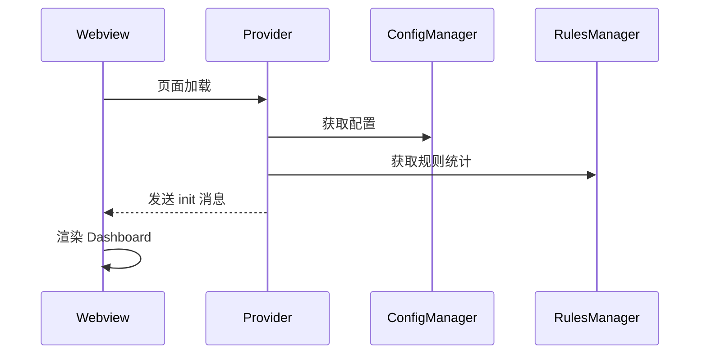
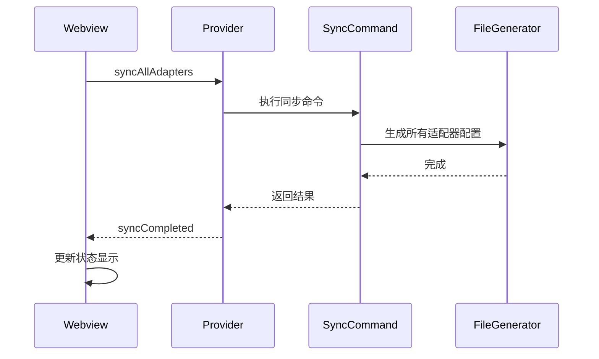

# SuperDesign 设计文档 - 扩展首页 Dashboard

> **Webview 实现**: `src/webview/dashboard/`  
> **HTML 原型**: `design_iterations/02-dashboard_1.html`  
> **实施文档**: `docs/implementation/ui/02-dashboard-implementation.md`  
> **最后更新**: 2026-02-03  
> **页面名称**: Dashboard (扩展功能中心)  
> **用途**: 扩展主入口,提供所有功能的快捷访问和状态概览  
> **优先级**: high

---

## 📋 设计目标

创建一个清晰的扩展首页,让用户能够:

- 🎯 快速访问所有核心功能
- 📊 查看规则源和适配器状态概览
- 🔄 执行快捷操作(同步、生成配置等)
- 💡 获得引导和帮助信息

---

## 🎨 布局设计

### 整体结构

```
┌──────────────────────────────────────────────────────────────┐
│  Dashboard                              [⚙️ 设置] [❓ 帮助] │
├──────────────────────────────────────────────────────────────┤
│                                                              │
│  📦 规则源管理                                                │
│  ┌────────────────────────────────────────────────────┐  │
│  │  [✅ company-rules 15] [✅ personal-rules 30]          │  │
│  │  [❌ archived-rules 0]                                 │  │
│  │  ─────────────────────────────────────────────     │  │
│  │  🕐 最后同步: 2 分钟前                                 │  │
│  │                                                         │  │
│  │  [🔄 快速同步规则]  [➕ 添加规则源]                    │  │
│  │  [📋 管理规则源]                                      │  │
│  └────────────────────────────────────────────────────┘  │
│                                                              │
│  🎯 适配器状态                                                │
│  ┌────────────────────────────────────────────────────────┐  │
│  │  ✅ GitHub Copilot (15 条规则)                         │  │
│  │     输出: .github/copilot-instructions.md              │  │
│  │     最后生成: 2 分钟前                                 │  │
│  │                                                         │  │
│  │  ✅ Cursor (20 条规则)                                 │  │
│  │     输出: .cursorrules                                  │  │
│  │     最后生成: 2 分钟前                                 │  │
│  │                                                         │  │
│  │  ❌ Continue (未启用)                                  │  │
│  │                                                         │  │
│  │  ✅ Default Rules (45 条规则)                          │  │
│  │     输出: rules/                                        │  │
│  │     最后生成: 2 分钟前                                 │  │
│  │                                                         │  │
│  │  [🌲 规则同步页]  [📤 重新生成适配器配置]            │  │
│  │  [⚙️ 管理适配器]                                    │  │
│  └────────────────────────────────────────────────────────┘  │
│                                                              │
│  🔍 快速操作                                                  │
│  ┌────────────────────────────────────────────────────────┐  │
│  │  [📖 快速开始]      [📊 统计面板]      [🔍 高级搜索]  │  │
│  │  [🌲 规则同步页]                                        │  │
│  └────────────────────────────────────────────────────────┘  │
│                                                              │
│  💡 快速入门                                                  │
│  ┌────────────────────────────────────────────────────────┐  │
│  │  👋 新用户?                                             │  │
│  │  • [查看欢迎页和快速入门指南]                          │  │
│  │  • [了解规则格式和编写规范]                            │  │
│  │  • [浏览示例规则库]                                    │  │
│  └────────────────────────────────────────────────────────┘  │
│                                                              │
└──────────────────────────────────────────────────────────────┘
```

### 响应式布局

**桌面端 (> 900px)**:

- 单列布局,最大宽度 1000px 居中
- 所有卡片完整展示

**平板端 (600px - 900px)**:

- 单列布局,填充宽度
- 按钮文字可能缩短

**移动端 (< 600px)**:

- 垂直堆叠
- 按钮仅显示图标

---

## 🎨 视觉设计

### 配色方案

```css
/* 容器 */
.dashboard-container {
  background-color: var(--vscode-editor-background);
  color: var(--vscode-foreground);
  padding: var(--spacing-lg);
  max-width: 1000px;
  margin: 0 auto;
}

/* 功能卡片 */
.feature-card {
  background-color: var(--vscode-editorWidget-background);
  border: 1px solid var(--vscode-editorWidget-border);
  border-radius: var(--border-radius);
  padding: var(--spacing-lg);
  margin-bottom: var(--spacing-lg);
}

.feature-card-header {
  display: flex;
  align-items: center;
  margin-bottom: var(--spacing-md);
  font-size: 1.2rem;
  font-weight: 600;
}

.feature-card-header i {
  margin-right: var(--spacing-sm);
}

/* 状态指示器 */
.status-item {
  display: flex;
  align-items: center;
  padding: var(--spacing-sm) 0;
  border-bottom: 1px solid var(--vscode-editorWidget-border);
}

.status-item:last-child {
  border-bottom: none;
}

.status-icon {
  margin-right: var(--spacing-sm);
}

.status-icon.enabled {
  color: var(--vscode-testing-iconPassed);
}

.status-icon.disabled {
  color: var(--vscode-descriptionForeground);
}

/* 按钮组 */
.button-group {
  display: flex;
  gap: var(--spacing-sm);
  flex-wrap: wrap;
  margin-top: var(--spacing-md);
}

.btn-primary {
  background-color: var(--vscode-button-background);
  color: var(--vscode-button-foreground);
  border: none;
  padding: var(--spacing-sm) var(--spacing-md);
  border-radius: var(--border-radius);
  cursor: pointer;
  display: inline-flex;
  align-items: center;
  gap: var(--spacing-xs);
}

.btn-primary:hover {
  background-color: var(--vscode-button-hoverBackground);
}

.btn-secondary {
  background-color: var(--vscode-button-secondaryBackground);
  color: var(--vscode-button-secondaryForeground);
}

.btn-secondary:hover {
  background-color: var(--vscode-button-secondaryHoverBackground);
}

/* 统计信息 */
.stats-info {
  color: var(--vscode-descriptionForeground);
  font-size: 0.95rem;
  margin-bottom: var(--spacing-sm);
}

.stats-info i {
  margin-right: var(--spacing-xs);
}

/* 快速入门链接 */
.quick-start-links {
  list-style: none;
  padding: 0;
  margin: 0;
}

.quick-start-links li {
  padding: var(--spacing-xs) 0;
}

.quick-start-links a {
  color: var(--vscode-textLink-foreground);
  text-decoration: none;
}

.quick-start-links a:hover {
  color: var(--vscode-textLink-activeForeground);
  text-decoration: underline;
}
```

### 图标使用

```html
<!-- 规则源 -->
<i class="codicon codicon-folder-library"></i>

<!-- 同步 -->
<i class="codicon codicon-sync"></i>

<!-- 添加 -->
<i class="codicon codicon-add"></i>

<!-- 管理 -->
<i class="codicon codicon-settings-gear"></i>

<!-- 浏览 -->
<i class="codicon codicon-search"></i>

<!-- 适配器 -->
<i class="codicon codicon-extensions"></i>

<!-- 生成 -->
<i class="codicon codicon-file-code"></i>

<!-- 成功 -->
<i class="codicon codicon-pass"></i>

<!-- 禁用 -->
<i class="codicon codicon-circle-slash"></i>

<!-- 帮助 -->
<i class="codicon codicon-question"></i>
```

---

## ✨ 交互设计

### 快捷操作

**快速同步规则**:

- 点击后显示进度提示
- 完成后显示成功/失败通知
- 自动刷新适配器状态
- 只同步到已启用的规则类型适配器

**添加规则源**:

- 打开添加规则源向导
- 支持 Git URL、分支、认证等配置

**管理规则源**:

- 打开规则源详情页面
- 显示所有规则源列表
- 支持编辑、删除、启用/禁用

**规则同步页**:

- 打开规则同步页面（树形视图）
- 显示所有规则源的规则列表
- 支持勾选/取消规则并保存选择状态
- 可实时看到选中规则数量和适配器映射

**重新生成适配器配置**:

- 在适配器卡片区域提供
- 手动触发所有启用适配器的配置文件生成
- 使用本地已缓存的规则（不从 Git 拉取）
- Skills 适配器会实时读取技能文件
- 显示生成进度和结果

**管理适配器**:

- 打开适配器配置页面
- 显示预置适配器和自定义适配器
- 支持启用/禁用、编辑、删除

**快速同步规则**:

- 在适配器卡片区域提供
- 手动触发所有启用适配器的配置文件生成
- 使用本地已缓存的规则（不从 Git 拉取）
- Skills 适配器会实时读取技能文件
- 显示生成进度和结果

**快速同步规则**:

- 打开规则同步页面(原规则选择器)
- 左侧显示所有规则源的规则树
- 右侧显示适配器勾选列表
- 用户选择规则并指定同步到哪些适配器

**设置按钮**:

- 当前打开 VSCode 原生扩展设置 (turboAiRules.\*)
- 后续计划: 实现自定义设置页面管理复杂配置 (SettingsWebviewProvider)
- 自定义设置页将支持: 可视化编辑自定义适配器、规则源认证、高级选项

**帮助按钮**:

- 打开扩展文档或快速帮助页面

### 动画效果

```css
/* 卡片加载动画 */
@keyframes fadeIn {
  from {
    opacity: 0;
    transform: translateY(10px);
  }
  to {
    opacity: 1;
    transform: translateY(0);
  }
}

.feature-card {
  animation: fadeIn 0.4s ease-out;
}

/* 按钮加载状态 */
.btn-loading {
  position: relative;
  color: transparent;
}

.btn-loading::after {
  content: '';
  position: absolute;
  width: 16px;
  height: 16px;
  top: 50%;
  left: 50%;
  margin-left: -8px;
  margin-top: -8px;
  border: 2px solid var(--vscode-button-foreground);
  border-top-color: transparent;
  border-radius: 50%;
  animation: spin 0.8s linear infinite;
}

@keyframes spin {
  to {
    transform: rotate(360deg);
  }
}
```

---

## 🔌 消息通信

### Extension → Webview

```typescript
// 初始化数据
{
  type: 'init',
  payload: {
    sources: {
      total: number,
      enabled: number,
      totalRules: number,
      lastSync: string,
      // 规则源列表（简要信息）
      list: Array<{
        id: string,
        name: string,
        enabled: boolean,
        ruleCount: number
      }>
    },
    adapters: {
      id: string,
      name: string,
      enabled: boolean,
      ruleCount: number,
      outputPath: string,
      lastGenerated: string
    }[],
    quickLinks: {
      welcomePage: boolean,
      documentation: string
    }
  }
}

// 同步完成
{
  type: 'syncCompleted',
  payload: {
    success: boolean,
    message: string,
    sourcesUpdated: number,
    rulesUpdated: number
  }
}

// 配置生成完成
{
  type: 'configsGenerated',
  payload: {
    success: boolean,
    adaptersUpdated: string[]
  }
}
```

### Webview → Extension

```typescript
// 快速同步规则
{
  type: 'syncAllAdapters';
}

// 添加规则源
{
  type: 'addSource';
}

// 管理规则源
{
  type: 'manageSources';
}

// 规则同步页
{
  type: 'openRuleSyncPage';
}

// 重新生成适配器配置
{
  type: 'regenerateAll';
}

// 管理适配器
{
  type: 'manageAdapters';
}

// 打开规则同步页
{
  type: 'openRuleSyncPage';
}

// 打开统计面板
{
  type: 'openStatistics';
}

// 打开欢迎页
{
  type: 'openWelcome';
}
```

---

## ♿ 无障碍支持

### 键盘导航

| 按键        | 功能                 |
| ----------- | -------------------- |
| `Tab`       | 切换焦点到下一个按钮 |
| `Shift+Tab` | 切换焦点到上一个按钮 |
| `Enter`     | 激活按钮             |
| `Esc`       | 关闭弹窗(如果有)     |

### ARIA 属性

```html
<!-- 功能卡片 -->
<section class="feature-card" aria-label="规则源管理">
  <h2 class="feature-card-header">
    <i class="codicon codicon-folder-library"></i>
    规则源管理
  </h2>
  <!-- 内容 -->
</section>

<!-- 按钮 -->
<button class="btn-primary" aria-label="快速同步规则" role="button">
  <i class="codicon codicon-sync"></i>
  快速同步规则
</button>

<!-- 状态列表 -->
<div class="status-item" role="listitem">
  <i class="codicon codicon-pass status-icon enabled" aria-label="已启用"></i>
  <span>GitHub Copilot (15 条规则)</span>
</div>
```

---

## 📊 数据流

### 初始化流程



### 同步流程



---

## 🎯 实现要点

### 状态管理

Dashboard 需要实时反映:

- 规则源数量和状态
- 适配器启用情况
- 规则总数
- 最后同步时间
- 最后生成时间

### 性能优化

- 使用缓存避免重复计算
- 懒加载适配器详情
- 防抖处理快捷操作

### 错误处理

- 同步失败显示友好错误信息
- 提供重试选项
- 记录错误日志

---

## 🔍 参考

- **UI 设计总览**: [30-ui-design-overview.md](../../docs/development/30-ui-design-overview.md)
- **欢迎页设计**: [01-welcome-page.md](./01-welcome-page.md)
- **适配器管理**: [13-adapter-manager.md](./13-adapter-manager.md)
- **规则同步页**: [05-rule-sync-page.md](./05-rule-sync-page.md)

---

_设计版本: 1.0_  
_创建日期: 2025-11-27_  
_设计师: AI (SuperDesign)_
