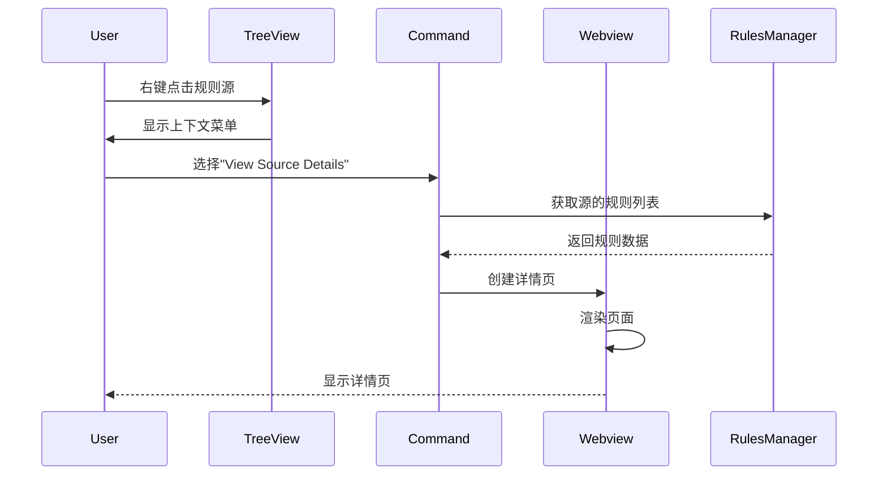
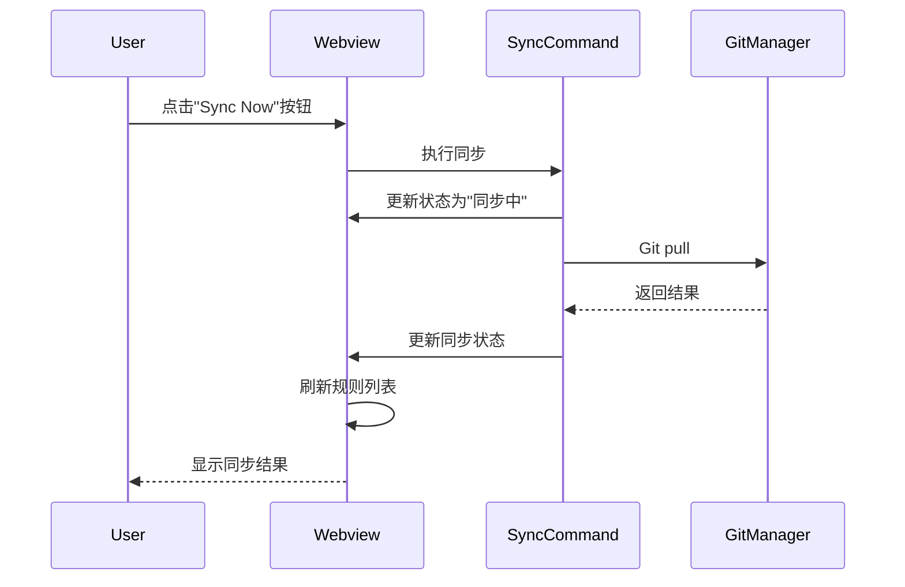
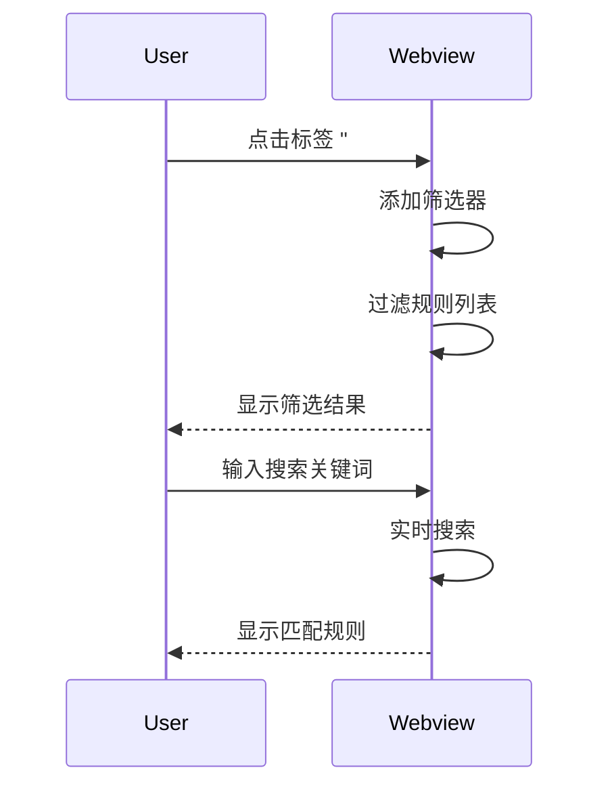

# 规则源详情页面设计

> **SuperDesign 设计文档**  
> **功能**: 查看单个规则源的详细信息、统计数据和规则列表  
> **优先级**: High  
> **创建日期**: 2025-10-29

---

## 📋 功能概述

### 设计目标

为用户提供一个专门的页面，展示单个规则源的完整信息，包括：

- 规则源的配置详情（Git 仓库、分支、路径等）
- 该源的统计数据（规则数量、标签分布、优先级分布）
- 该源包含的所有规则列表
- 快捷操作按钮（同步、编辑、启用/禁用、删除）

### 用户场景

1. **查看源的基本信息**: 用户想了解某个规则源的 Git 地址、分支、子路径等配置
2. **查看源的统计数据**: 了解该源有多少规则、什么优先级分布、常用标签
3. **浏览源的规则列表**: 快速浏览该源提供的所有规则
4. **执行源的操作**: 同步该源、编辑配置、启用/禁用、删除源

### 触发方式

- 在树视图中右键点击规则源 → 选择"View Source Details"
- 在状态栏点击 → 选择某个源 → "View Details"
- 命令面板: `Turbo AI Rules: View Source Details`

---

## 🎨 界面设计

### 整体布局

采用单页布局，分为以下几个区域：

```
┌──────────────────────────────────────────────────────────────┐
│  📦 Source Details                                      [×]  │
├──────────────────────────────────────────────────────────────┤
│                                                              │
│  ┌────────────────────────────────────────────────────────┐ │
│  │  Header Section (源的基本信息)                         │ │
│  │  - 源名称、状态、Git地址                               │ │
│  │  - 快捷操作按钮                                         │ │
│  └────────────────────────────────────────────────────────┘ │
│                                                              │
│  ┌────────────────────────────────────────────────────────┐ │
│  │  Configuration Section (配置详情)                      │ │
│  │  - 分支、子路径、认证方式                               │ │
│  │  - 最后同步时间、同步状态                               │ │
│  └────────────────────────────────────────────────────────┘ │
│                                                              │
│  ┌────────────────────────────────────────────────────────┐ │
│  │  Statistics Section (统计数据)                         │ │
│  │  - 规则总数、优先级分布                                 │ │
│  │  - 标签云、最常用标签                                   │ │
│  └────────────────────────────────────────────────────────┘ │
│                                                              │
│  ┌────────────────────────────────────────────────────────┐ │
│  │  Rules List Section (规则列表)                         │ │
│  │  - 该源的所有规则，可筛选、搜索                          │ │
│  │  - 点击规则可查看详情                                   │ │
│  └────────────────────────────────────────────────────────┘ │
│                                                              │
└──────────────────────────────────────────────────────────────┘
```

---

## 📐 详细设计

### 1. Header Section (头部区域)

**目的**: 展示源的核心信息和快捷操作

**布局**:

```
┌──────────────────────────────────────────────────────────┐
│  📦 Company Coding Rules                           [●]   │
│  🔗 https://github.com/company/coding-rules.git          │
│                                                          │
│  [🔄 Sync Now]  [✏️ Edit]  [⚙️ Toggle]  [🗑️ Delete]    │
└──────────────────────────────────────────────────────────┘
```

**元素说明**:

| 元素           | 说明                                           | 样式                                                          |
| -------------- | ---------------------------------------------- | ------------------------------------------------------------- |
| **源名称**     | 大号标题，显示源的名称                         | `font-size: 24px`, `font-weight: bold`                        |
| **状态指示器** | 圆点指示器 (绿色=启用, 灰色=禁用, 橙色=同步中) | 直径 12px 的圆点                                              |
| **Git URL**    | 源的仓库地址，可点击复制                       | `font-size: 14px`, `color: var(--vscode-textLink-foreground)` |
| **操作按钮**   | 4 个主要操作按钮                               | VS Code 主题按钮样式                                          |

**操作按钮**:

1. **🔄 Sync Now**: 立即同步该源
2. **✏️ Edit**: 编辑源配置（打开编辑对话框）
3. **⚙️ Toggle**: 启用/禁用该源
4. **🗑️ Delete**: 删除该源（带确认提示）

**状态指示器颜色**:

- 🟢 绿色: 已启用且同步成功
- 🟡 橙色: 正在同步中
- 🔴 红色: 同步失败
- ⚫ 灰色: 已禁用

---

### 2. Configuration Section (配置区域)

**目的**: 展示源的详细配置信息

**布局**:

```
┌──────────────────────────────────────────────────────────┐
│  Configuration Details                                   │
├──────────────────────────────────────────────────────────┤
│                                                          │
│  🌿 Branch:        main                                  │
│  📁 Sub Path:      /best-practices                       │
│  🔑 Authentication: Private (Token configured)           │
│  🆔 Source ID:     source-abc123                         │
│                                                          │
│  📊 Sync Status                                          │
│  • Last Synced:    2025-10-29 14:30:25                   │
│  • Status:         ✅ Success (156 rules)                │
│  • Cache Size:     2.3 MB                                │
│  • Next Auto Sync: in 45 minutes                         │
│                                                          │
└──────────────────────────────────────────────────────────┘
```

**字段说明**:

| 字段               | 说明                  | 数据来源                |
| ------------------ | --------------------- | ----------------------- |
| **Branch**         | Git 分支名称          | `source.branch`         |
| **Sub Path**       | 规则文件所在子路径    | `source.subPath`        |
| **Authentication** | 认证方式（公开/私有） | `source.authentication` |
| **Source ID**      | 源的唯一标识符        | `source.id`             |
| **Last Synced**    | 最后同步时间          | 从缓存或日志读取        |
| **Status**         | 同步状态和规则数      | 实时计算                |
| **Cache Size**     | 缓存占用大小          | 计算本地缓存文件夹大小  |
| **Next Auto Sync** | 下次自动同步时间      | 根据配置计算            |

**样式**:

- 使用图标前缀增强可读性
- 使用等宽字体显示 ID
- 同步状态使用颜色编码（✅ 绿色, ⚠️ 橙色, ❌ 红色）

---

### 3. Statistics Section (统计区域)

**目的**: 展示该源的规则统计数据

**布局**:

```
┌──────────────────────────────────────────────────────────┐
│  Statistics Overview                                     │
├──────────────────────────────────────────────────────────┤
│                                                          │
│  📊 Total Rules: 156                                     │
│                                                          │
│  📈 Rules by Priority                                    │
│  🔥 High:     23  ████████░░░░░░░░░░░░░░░ 15%           │
│  ⚠️ Medium:   67  ██████████████████░░░░░ 43%           │
│  ℹ️ Low:      66  █████████████████░░░░░░ 42%           │
│                                                          │
│  🏷️ Top Tags                                            │
│  [typescript 45]  [react 32]  [eslint 28]               │
│  [naming 24]  [security 18]  [testing 15]                │
│                                                          │
│  📅 Recent Activity                                      │
│  • Created: 2024-03-15                                   │
│  • Last Updated: 2025-10-29                              │
│  • Total Syncs: 127                                      │
│                                                          │
└──────────────────────────────────────────────────────────┘
```

**数据可视化**:

1. **优先级分布条形图**:

   - 使用文本块字符 (█) 绘制简单条形图
   - 显示百分比和数量
   - 颜色编码: 高=红色, 中=橙色, 低=蓝色

2. **标签云**:

   - 显示前 6 个最常用标签
   - 标签大小根据使用频率调整
   - 可点击标签筛选规则

3. **活动时间线**:
   - 显示源的创建时间、最后更新时间
   - 显示总同步次数

**交互**:

- 点击标签可筛选该标签的规则
- 悬停在条形图上显示详细数字

---

### 4. Rules List Section (规则列表区域)

**目的**: 展示该源包含的所有规则，支持搜索和筛选

**布局**:

```
┌──────────────────────────────────────────────────────────┐
│  Rules List (156)                         [Search: ___]  │
├──────────────────────────────────────────────────────────┤
│  Filters: [All] [High Priority] [Medium] [Low]           │
│           [#typescript] [#react] [#eslint] [Clear]       │
├──────────────────────────────────────────────────────────┤
│                                                          │
│  🔥 TypeScript Naming Conventions                 [View] │
│     📁 rules/typescript/naming.mdc                       │
│     🏷️ typescript, naming, style                         │
│                                                          │
│  ⚠️ React Hooks Best Practices                   [View] │
│     📁 rules/react/hooks.mdc                             │
│     🏷️ react, hooks, patterns                            │
│                                                          │
│  ℹ️ ESLint Configuration Guide                   [View] │
│     📁 rules/tools/eslint.mdc                            │
│     🏷️ eslint, configuration, tools                      │
│                                                          │
│  ... (更多规则)                                          │
│                                                          │
│  [Load More] or [Show All 156 Rules]                     │
│                                                          │
└──────────────────────────────────────────────────────────┘
```

**功能特性**:

1. **搜索框**: 实时搜索规则名称
2. **快捷筛选器**:

   - 按优先级筛选
   - 按标签筛选（点击统计区的标签自动添加）
   - 清除所有筛选

3. **规则卡片**:

   - 显示规则名称、优先级图标
   - 显示文件路径
   - 显示标签列表
   - [View] 按钮打开规则详情

4. **分页加载**:
   - 初始显示 20 条规则
   - 提供"Load More"按钮加载更多
   - 或提供"Show All"一次性显示所有规则

**样式设计**:

```css
.rule-item {
  border: 1px solid var(--vscode-panel-border);
  border-radius: 4px;
  padding: 12px;
  margin-bottom: 8px;
  background: var(--vscode-editor-background);
}

.rule-item:hover {
  background: var(--vscode-list-hoverBackground);
  cursor: pointer;
}

.rule-title {
  font-size: 16px;
  font-weight: 600;
  margin-bottom: 4px;
}

.rule-path {
  font-size: 12px;
  color: var(--vscode-descriptionForeground);
  margin-bottom: 4px;
}

.rule-tags {
  display: flex;
  gap: 8px;
  flex-wrap: wrap;
}

.tag {
  background: var(--vscode-badge-background);
  color: var(--vscode-badge-foreground);
  padding: 2px 8px;
  border-radius: 12px;
  font-size: 11px;
}
```

---

## 🔄 交互流程

### 打开详情页



### 同步规则源



### 筛选规则



---

## 📨 消息协议

### Webview → Extension

```typescript
type SourceDetailsMessage =
  | { type: 'syncSource'; sourceId: string }
  | { type: 'editSource'; sourceId: string }
  | { type: 'toggleSource'; sourceId: string }
  | { type: 'deleteSource'; sourceId: string }
  | { type: 'viewRule'; rulePath: string }
  | { type: 'filterByTag'; tag: string }
  | { type: 'searchRules'; query: string }
  | { type: 'refresh' };
```

### Extension → Webview

```typescript
type SourceDetailsResponse =
  | {
      type: 'sourceData';
      source: RuleSource;
      rules: ParsedRule[];
      statistics: SourceStatistics;
      syncInfo: SyncInfo;
    }
  | { type: 'syncStatus'; status: 'syncing' | 'success' | 'error'; message?: string }
  | { type: 'error'; message: string };

interface SourceStatistics {
  totalRules: number;
  priorityDistribution: {
    high: number;
    medium: number;
    low: number;
  };
  topTags: Array<{ tag: string; count: number }>;
  createdAt?: string;
  lastUpdated?: string;
  totalSyncs?: number;
}

interface SyncInfo {
  lastSynced?: string;
  status: 'success' | 'error' | 'never';
  message?: string;
  cacheSize?: string;
  nextAutoSync?: string;
}
```

---

## 🎯 实现要点

### 1. 数据收集

**需要实现的数据收集方法**:

```typescript
class SourceStatisticsCollector {
  collectStatistics(source: RuleSource, rules: ParsedRule[]): SourceStatistics {
    // 计算优先级分布
    // 计算标签分布
    // 获取时间信息
  }

  getSyncInfo(source: RuleSource): SyncInfo {
    // 读取最后同步时间
    // 计算缓存大小
    // 计算下次自动同步时间
  }
}
```

### 2. 性能优化

- **虚拟滚动**: 规则列表超过 100 条时使用虚拟滚动
- **懒加载**: 初始只渲染前 20 条规则
- **缓存统计数据**: 统计数据缓存 5 分钟

### 3. 响应式设计

- 窗口宽度 < 600px 时，切换为移动端布局
- 统计图表使用百分比宽度
- 按钮使用 flexbox 自适应

---

## 🎨 主题适配

### VS Code 主题变量

使用以下 CSS 变量确保主题兼容:

```css
/* 背景颜色 */
--vscode-editor-background
--vscode-sideBar-background
--vscode-panel-background

/* 文字颜色 */
--vscode-foreground
--vscode-descriptionForeground
--vscode-textLink-foreground

/* 边框颜色 */
--vscode-panel-border
--vscode-widget-border

/* 状态颜色 */
--vscode-errorForeground        /* 红色 - 高优先级 */
--vscode-warningForeground      /* 橙色 - 中优先级 */
--vscode-charts-blue            /* 蓝色 - 低优先级 */
--vscode-charts-green           /* 绿色 - 成功状态 */

/* 交互颜色 */
--vscode-list-hoverBackground
--vscode-button-background
--vscode-button-foreground
```

---

## 📋 验收标准

### 功能完整性

- [ ] 正确显示源的所有配置信息
- [ ] 准确计算和显示统计数据
- [ ] 规则列表显示完整且可交互
- [ ] 所有操作按钮功能正常
- [ ] 搜索和筛选功能工作正常

### 性能要求

- [ ] 页面初始加载时间 < 500ms
- [ ] 统计数据计算时间 < 100ms
- [ ] 规则列表渲染时间 < 200ms
- [ ] 搜索响应时间 < 50ms

### 用户体验

- [ ] 界面布局清晰美观
- [ ] 按钮点击有视觉反馈
- [ ] 错误提示友好明确
- [ ] 主题切换无视觉错误
- [ ] 响应式布局正常

---

## 🔗 相关文档

- [WelcomeWebviewProvider](./01-welcome-page.md) - 欢迎页面设计
- [StatisticsWebviewProvider](./02-statistics-dashboard.md) - 统计仪表板设计
- [RuleDetailsWebviewProvider](./03-rule-details-panel.md) - 规则详情设计
- [Phase 3 设计](../../docs/development/07-ui-phase3-design.md) - UI Phase 3 整体设计

---

**状态**: 设计完成，待 SuperDesign 生成 HTML 原型  
**优先级**: High  
**预估工作量**: 设计 2 小时 + 集成 1.5 小时  
**下一步**: 将此文档交给 SuperDesign AI 生成 HTML 原型
