# 规则源详情页面设计

> **Webview 实现**: `src/webview/source-detail/`  
> **HTML 原型**: `design_iterations/08-source-details_1.html`  
> **实施文档**: `docs/implementation/ui/08-source-details-implementation.md`  
> **最后更新**: 2026-02-03  
> **SuperDesign 设计文档**  
> **功能**: 查看单个规则源的详细信息、统计数据和规则列表  
> **优先级**: High  
> **创建日期**: 2025-10-29

---

## 📋 功能概述

### 设计目标

为用户提供一个专门的页面，展示单个规则源的完整信息，包括：

- 规则源的配置详情（Git 仓库、分支、路径等）
- 该源的统计数据（规则数量、标签分布、优先级分布）
- 该源包含的所有规则列表
- 快捷操作按钮（同步、编辑、启用/禁用、删除）

### 用户场景

1. **查看源的基本信息**: 用户想了解某个规则源的 Git 地址、分支、子路径等配置
2. **查看源的统计数据**: 了解该源有多少规则、什么优先级分布、常用标签
3. **浏览源的规则列表**: 快速浏览该源提供的所有规则
4. **执行源的操作**: 同步该源、编辑配置、启用/禁用、删除源

### 触发方式

- 在树视图中右键点击规则源 → 选择"View Source Details"
- 在状态栏点击 → 选择某个源 → "View Details"
- 命令面板: `Turbo AI Rules: View Source Details`

---

## 🎨 界面设计

### 整体布局

采用单页布局，分为以下几个区域：

```
┌──────────────────────────────────────────────────────────────┐
│  📦 Source Details                                      [×]  │
├──────────────────────────────────────────────────────────────┤
│                                                              │
│  ┌────────────────────────────────────────────────────────┐ │
│  │  Header Section (源的基本信息)                         │ │
│  │  - 源名称、状态、Git地址                               │ │
│  │  - 快捷操作按钮                                         │ │
│  └────────────────────────────────────────────────────────┘ │
│                                                              │
│  ┌────────────────────┬────────────────────────────────────┐ │
│  │ Configuration      │  Statistics Overview              │ │
│  │ Details            │  - 规则总数                        │ │
│  │ - 分支、子路径      │  - 优先级分布（带百分比条）         │ │
│  │ - 认证方式          │                                   │ │
│  │ - 同步状态          │                                   │ │
│  └────────────────────┴────────────────────────────────────┘ │
│                                                              │
│  ┌────────────────────────────────────────────────────────┐ │
│  │  Top Tags Section (热门标签)                           │ │
│  │  - 显示前6-8个最常用标签                                │ │
│  └────────────────────────────────────────────────────────┘ │
│                                                              │
│  ┌────────────────────────────────────────────────────────┐ │
│  │  Rules List Section (规则列表)                         │ │
│  │  - 该源的所有规则，可筛选、搜索                          │ │
│  │  - 点击规则可查看详情                                   │ │
│  └────────────────────────────────────────────────────────┘ │
│                                                              │
└──────────────────────────────────────────────────────────────┘
```

---

## 📐 详细设计

### 1. Header Section (头部区域)

**目的**: 展示源的核心信息和快捷操作

**布局**:

```
┌──────────────────────────────────────────────────────────┐
│  📦 Company Coding Rules                           [●]   │
│  🔗 https://github.com/company/coding-rules.git          │
│                                                          │
│  [🔄 Sync Now]  [✏️ Edit]  [⚙️ Toggle]  [🗑️ Delete]    │
└──────────────────────────────────────────────────────────┘
```

**元素说明**:

| 元素           | 说明                                           | 样式                                                          |
| -------------- | ---------------------------------------------- | ------------------------------------------------------------- |
| **源名称**     | 大号标题，显示源的名称                         | `font-size: 24px`, `font-weight: bold`                        |
| **状态指示器** | 圆点指示器 (绿色=启用, 灰色=禁用, 橙色=同步中) | 直径 12px 的圆点                                              |
| **Git URL**    | 源的仓库地址，可点击复制                       | `font-size: 14px`, `color: var(--vscode-textLink-foreground)` |
| **操作按钮**   | 4 个主要操作按钮                               | VS Code 主题按钮样式                                          |

**操作按钮**:

1. **🔄 Sync Now**: 立即同步该源
2. **✏️ Edit**: 编辑源配置（打开编辑对话框）
3. **⚙️ Toggle**: 启用/禁用该源
4. **🗑️ Delete**: 删除该源（带确认提示）

**状态指示器颜色**:

- 🟢 绿色: 已启用且同步成功
- 🟡 橙色: 正在同步中
- 🔴 红色: 同步失败
- ⚫ 灰色: 已禁用

---

---

### 2. Main Grid: Configuration + Statistics (主网格区域)

**目的**: 以两栏布局展示配置详情和统计数据

**布局**: 左右两栏，响应式设计

#### 左栏: Configuration Details (配置详情)

```
┌──────────────────────────────────────────────────────────┐
│  Configuration Details                                   │
├──────────────────────────────────────────────────────────┤
│                                                          │
│  Branch:          main                                   │
│  Sub Path:        /                                      │
│  Authentication:  Public                                 │
│                                                          │
│  Sync Status                                             │
│  Last Synced:     2025-11-06 09:11:35                    │
│  Status:          ● Disabled                             │
│                                                          │
└──────────────────────────────────────────────────────────┘
```

#### 右栏: Statistics Overview (统计概览)

```
┌──────────────────────────────────────────────────────────┐
│  Statistics Overview                                     │
├──────────────────────────────────────────────────────────┤
│                                                          │
│  Total Rules: 31                                         │
│                                                          │
│  Priority Distribution                                   │
│  🔥 High    ████░░░░░░░░░░░░░░░░░░░░  9 (29%)           │
│  ⭐ Medium  ████████████████████████  22 (71%)          │
│  ℹ️ Low     ░░░░░░░░░░░░░░░░░░░░░░░░  0 (0%)            │
│                                                          │
└──────────────────────────────────────────────────────────┘
```

**数据可视化**:

1. **优先级分布条形图**:

   - 使用进度条 (progress bar) 显示百分比
   - 显示数量和百分比
   - 颜色编码: 高=红色 (errorForeground), 中=橙色 (warningForeground), 低=蓝色 (charts-blue)

**响应式设计**:

- > = 768px: 两栏并排显示
- < 768px: 单栏堆叠显示

### 3. Top Tags Section (热门标签区域)

**目的**: 展示该源的常用标签

**布局**:

```
┌──────────────────────────────────────────────────────────┐
│  🏷️ Top Tags                                            │
├──────────────────────────────────────────────────────────┤
│  [vscode 6] [typescript 5] [testing 4] [react 4]         │
│  [performance 4] [microservices 3]                       │
└──────────────────────────────────────────────────────────┘
```

**交互**:

- 显示前 6-8 个最常用标签
- 标签显示名称和使用次数
- 点击标签可筛选该标签的规则

---

### 4. Rules List Section (规则列表区域)

**目的**: 展示该源包含的所有规则，支持搜索

**布局**:

```
┌──────────────────────────────────────────────────────────┐
│  规则 (31)                              [搜索规则...]    │
├──────────────────────────────────────────────────────────┤
│                                                          │
│  ┌────────────────────────────────────────────────────┐ │
│  │ AI 规则库 - Copilot 指导说明          ⭐          │ │
│  │ 跨项目通用AI编码规则-GitHub Copilot               │ │
│  │ [copilot]                                          │ │
│  │                                [View Details]      │ │
│  └────────────────────────────────────────────────────┘ │
│                                                          │
│  ┌────────────────────────────────────────────────────┐ │
│  │ 通用编码规范                          ⭐          │ │
│  │ 跨项目通用编码规范                                 │ │
│  │ [naming] [style]                                   │ │
│  │                                [View Details]      │ │
│  └────────────────────────────────────────────────────┘ │
│                                                          │
└──────────────────────────────────────────────────────────┘
```

**功能特性**:

1. **搜索框**: 实时搜索规则名称和内容
2. **规则卡片**:
   - 显示规则标题和优先级图标（⭐ 中优先级，🔥 高优先级，ℹ️ 低优先级）
   - 显示描述
   - 显示标签列表
   - [View Details] 按钮查看规则详情

**样式设计**:

- 规则卡片使用 Card 组件样式
- 标题字体 16px，加粗
- 描述使用 descriptionForeground 颜色
- 标签使用 Tag 组件样式
- 按钮靠右下角对齐

---

## 🔄 交互流程

### 打开详情页

```mermaid
sequenceDiagram
    participant User
    participant TreeView
    participant Command
    participant Webview
    participant RulesManager

    User->>TreeView: 右键点击规则源
    TreeView->>User: 显示上下文菜单
    User->>Command: 选择"View Source Details"
    Command->>RulesManager: 获取源的规则列表
    RulesManager-->>Command: 返回规则数据
    Command->>Webview: 创建详情页
    Webview->>Webview: 渲染页面
    Webview-->>User: 显示详情页
```



### 同步规则源

```mermaid
sequenceDiagram
    participant User
    participant Webview
    participant SyncCommand
    participant GitManager

    User->>Webview: 点击"Sync Now"按钮
    Webview->>SyncCommand: 执行同步
    SyncCommand->>Webview: 更新状态为"同步中"
    SyncCommand->>GitManager: Git pull
    GitManager-->>SyncCommand: 返回结果
    SyncCommand->>Webview: 更新同步状态
    Webview->>Webview: 刷新规则列表
    Webview-->>User: 显示同步结果
```



### 筛选规则

```mermaid
sequenceDiagram
    participant User
    participant Webview

    User->>Webview: 点击标签 "#typescript"
    Webview->>Webview: 添加筛选器
    Webview->>Webview: 过滤规则列表
    Webview-->>User: 显示筛选结果

    User->>Webview: 输入搜索关键词
    Webview->>Webview: 实时搜索
    Webview-->>User: 显示匹配规则
```



---

## 📨 消息协议

### Webview → Extension

```typescript
type SourceDetailsMessage =
  | { type: 'syncSource'; sourceId: string }
  | { type: 'editSource'; sourceId: string }
  | { type: 'toggleSource'; sourceId: string }
  | { type: 'deleteSource'; sourceId: string }
  | { type: 'viewRule'; rulePath: string }
  | { type: 'filterByTag'; tag: string }
  | { type: 'searchRules'; query: string }
  | { type: 'refresh' };
```

### Extension → Webview

```typescript
type SourceDetailsResponse =
  | {
      type: 'sourceData';
      source: RuleSource;
      rules: ParsedRule[];
      statistics: SourceStatistics;
      syncInfo: SyncInfo;
    }
  | { type: 'syncStatus'; status: 'syncing' | 'success' | 'error'; message?: string }
  | { type: 'error'; message: string };

interface SourceStatistics {
  totalRules: number;
  priorityDistribution: {
    high: number;
    medium: number;
    low: number;
  };
  topTags: Array<{ tag: string; count: number }>;
  createdAt?: string;
  lastUpdated?: string;
  totalSyncs?: number;
}

interface SyncInfo {
  lastSynced?: string;
  status: 'success' | 'error' | 'never';
  message?: string;
  cacheSize?: string;
  nextAutoSync?: string;
}
```

---

## 🎯 实现要点

### 1. 数据收集

**需要实现的数据收集方法**:

```typescript
class SourceStatisticsCollector {
  collectStatistics(source: RuleSource, rules: ParsedRule[]): SourceStatistics {
    // 计算优先级分布
    // 计算标签分布
    // 获取时间信息
  }

  getSyncInfo(source: RuleSource): SyncInfo {
    // 读取最后同步时间
    // 计算缓存大小
    // 计算下次自动同步时间
  }
}
```

### 2. 性能优化

- **虚拟滚动**: 规则列表超过 100 条时使用虚拟滚动
- **懒加载**: 初始只渲染前 20 条规则
- **缓存统计数据**: 统计数据缓存 5 分钟

### 3. 响应式设计

- 窗口宽度 < 600px 时，切换为移动端布局
- 统计图表使用百分比宽度
- 按钮使用 flexbox 自适应

---

## 🎨 主题适配

### VS Code 主题变量

使用以下 CSS 变量确保主题兼容:

```css
/* 背景颜色 */
--vscode-editor-background
--vscode-sideBar-background
--vscode-panel-background

/* 文字颜色 */
--vscode-foreground
--vscode-descriptionForeground
--vscode-textLink-foreground

/* 边框颜色 */
--vscode-panel-border
--vscode-widget-border

/* 状态颜色 */
--vscode-errorForeground        /* 红色 - 高优先级 */
--vscode-warningForeground      /* 橙色 - 中优先级 */
--vscode-charts-blue            /* 蓝色 - 低优先级 */
--vscode-charts-green           /* 绿色 - 成功状态 */

/* 交互颜色 */
--vscode-list-hoverBackground
--vscode-button-background
--vscode-button-foreground
```

---

## 📋 验收标准

### 功能完整性

- [ ] 正确显示源的所有配置信息
- [ ] 准确计算和显示统计数据
- [ ] 规则列表显示完整且可交互
- [ ] 所有操作按钮功能正常
- [ ] 搜索和筛选功能工作正常

### 性能要求

- [ ] 页面初始加载时间 < 500ms
- [ ] 统计数据计算时间 < 100ms
- [ ] 规则列表渲染时间 < 200ms
- [ ] 搜索响应时间 < 50ms

### 用户体验

- [ ] 界面布局清晰美观
- [ ] 按钮点击有视觉反馈
- [ ] 错误提示友好明确
- [ ] 主题切换无视觉错误
- [ ] 响应式布局正常

---

## 🔗 相关文档

- [WelcomeWebviewProvider](./01-welcome-page.md) - 欢迎页面设计
- [StatisticsWebviewProvider](./02-statistics-dashboard.md) - 统计仪表板设计
- [RuleDetailsWebviewProvider](./03-rule-details-panel.md) - 规则详情设计
- [Phase 3 设计](../../docs/development/07-ui-phase3-design.md) - UI Phase 3 整体设计

---

**状态**: 设计完成，待 SuperDesign 生成 HTML 原型  
**优先级**: High  
**预估工作量**: 设计 2 小时 + 集成 1.5 小时  
**下一步**: 将此文档交给 SuperDesign AI 生成 HTML 原型
