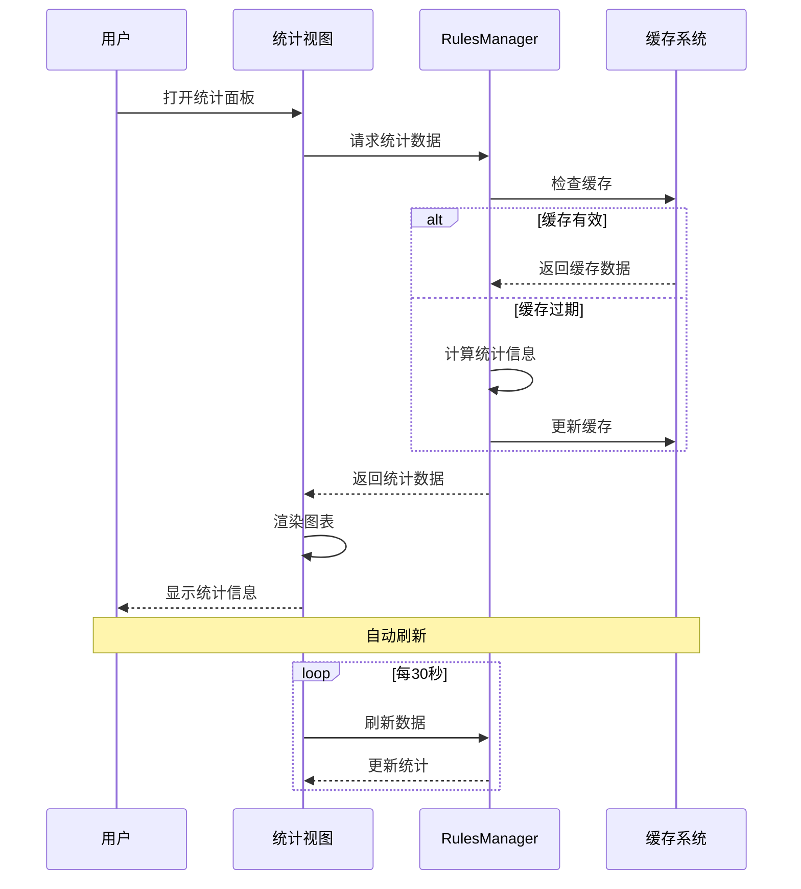
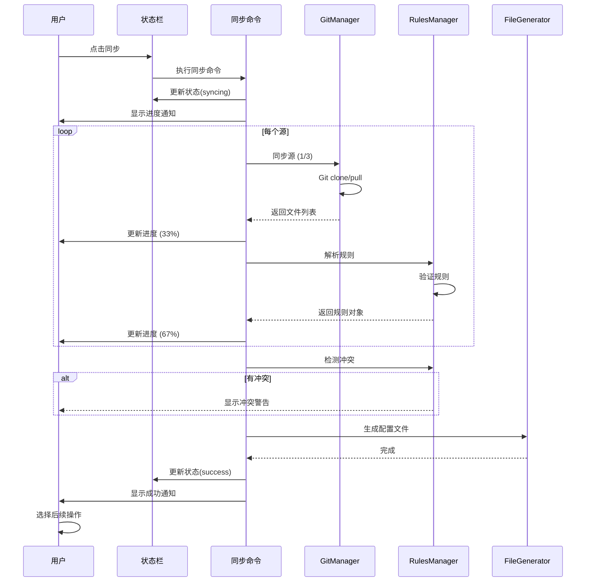
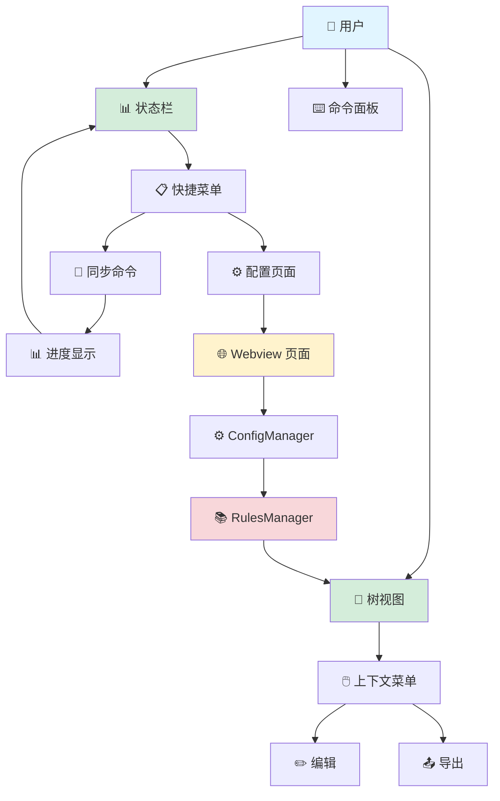
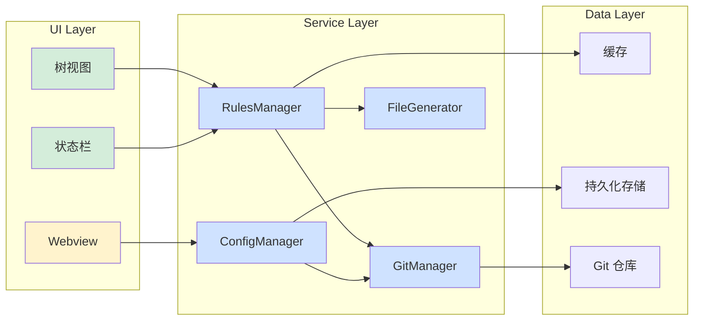
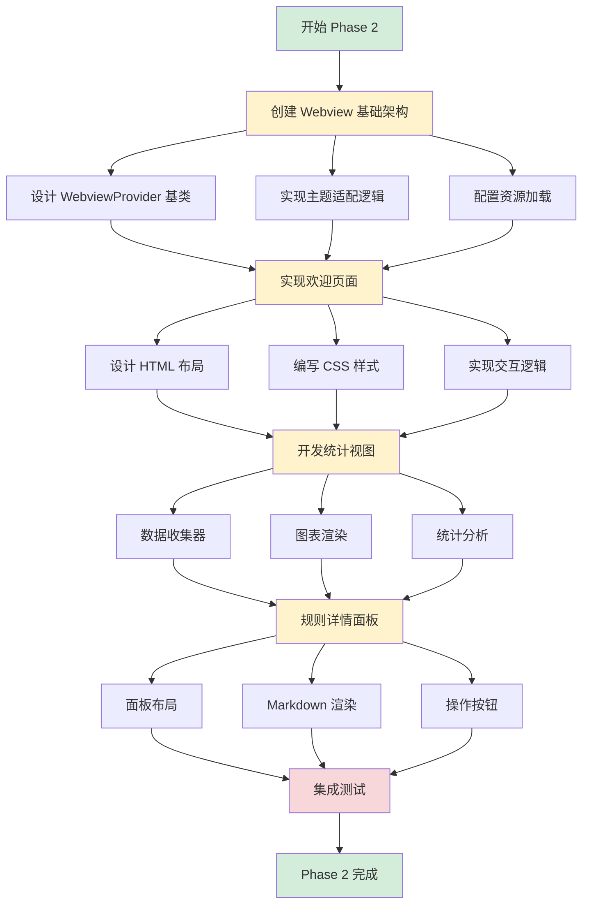
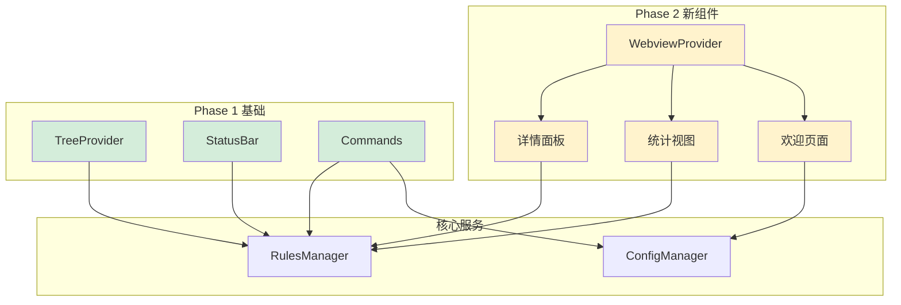

# Turbo AI Rules - UI 设计方案

> 版本: 2.0 | 状态: Phase 2 完成

---

## 📋 目录

- [项目概述](#项目概述)
- [现状分析](#现状分析)
- [设计目标](#设计目标)
- [UI 组件设计](#ui-组件设计)
- [技术实现](#技术实现)
- [实施路线图](#实施路线图)
- [已完成功能](#已完成功能)

---

## 项目概述

**Turbo AI Rules** 是一个 VS Code 扩展，用于从外部 Git 仓库同步 AI 编码规则并自动生成配置文件。

### 核心功能

- 🔄 多源规则同步
- 🎯 智能适配器（Cursor, Copilot, Continue 等）
- 🔍 规则搜索与管理
- 📊 可视化统计面板

---

## 现状分析

### 当前 UI 组件

| 组件                  | 功能           | 状态                |
| --------------------- | -------------- | ------------------- |
| **RulesTreeProvider** | 侧边栏树视图   | ✅ Phase 1 优化完成 |
| **StatusBarProvider** | 状态栏快捷操作 | ✅ Phase 1 增强完成 |
| **Commands**          | 命令面板集成   | ✅ 持续完善中       |

### Phase 1 已完成改进

✅ **视觉增强**

- VS Code Codicons 图标系统
- 优先级颜色编码（高 🔥/中 ⚠️/低 ℹ️）
- 丰富的 Tooltip 信息
- 描述文本显示关键信息

✅ **交互优化**

- 右键上下文菜单（源/规则操作）
- 键盘快捷键支持
- 智能进度反馈
- 可取消的长时间操作

✅ **状态管理**

- 多状态支持（初始化/同步/成功/错误）
- 自动状态转换
- 动态快捷菜单
- 冲突检测显示

---

## 设计目标

### 核心目标

```
┌─────────────────────────────────────────────────────────┐
│  🎯 降低学习成本    →  直观的可视化界面              │
│  ⚡ 提升操作效率    →  快捷操作和键盘支持            │
│  📊 增强信息可见    →  丰富的状态展示                │
│  🎨 改善用户体验    →  流畅的交互和即时反馈          │
└─────────────────────────────────────────────────────────┘
```

### 设计原则

| 原则       | 说明                                 |
| ---------- | ------------------------------------ |
| **一致性** | 遵循 VS Code 设计语言和交互模式      |
| **简洁性** | 避免界面过于复杂，保持清晰的信息层次 |
| **响应性** | 快速响应用户操作，提供即时反馈       |

---

## UI 组件设计

### 1. 侧边栏面板（Phase 2 目标）

#### 1.1 多视图架构

```
┌──────────────────────────────────────────┐
│  🎯 AI Rules                          ⚙️  │
├──────────────────────────────────────────┤
│                                          │
│  📂 SOURCES (3)                          │
│  ├─ 🟢 My Team Rules         main   ✓   │
│  ├─ 🔴 Public Best Practices main   ✗   │
│  └─ 🟢 Personal Rules        main   ✓   │
│                                          │
│  📝 RULES (156)                          │
│  ├─ 🔥 TypeScript Naming     HIGH       │
│  ├─ ⚠️  React Hooks          MEDIUM     │
│  └─ ℹ️  ESLint Config        LOW        │
│                                          │
│  📊 STATISTICS                           │
│  ├─ Total Rules: 156                    │
│  ├─ Active Sources: 2/3                 │
│  ├─ Conflicts: 2                        │
│  └─ Last Sync: 2m ago                   │
│                                          │
└──────────────────────────────────────────┘
```

**实现方式**: 使用多个 TreeView，通过 `visible` 属性控制显示

#### 1.2 规则详情面板

```
┌──────────────────────────────────────────┐
│  📋 Rule Details                         │
├──────────────────────────────────────────┤
│  🔖 TypeScript Naming Conventions        │
│                                          │
│  🆔 ID: ts-naming-001                   │
│  ⚡ Priority: HIGH                       │
│  🏷️  Tags: typescript, naming, style    │
│  📦 Source: My Team Rules                │
│                                          │
│  📄 Content Preview:                     │
│  ┌────────────────────────────────────┐ │
│  │ Use camelCase for variables...    │ │
│  │ Use PascalCase for classes...     │ │
│  └────────────────────────────────────┘ │
│                                          │
│  [📋 Copy]  [📤 Export]  [❌ Ignore]    │
└──────────────────────────────────────────┘
```

**位置**: 侧边栏底部或独立面板

### 2. 欢迎页面（Webview）

#### 2.1 首次使用引导

```html
┌──────────────────────────────────────────────────────┐ │ │ │ 🚀 Welcome to Turbo AI Rules │ │ │ │
Sync AI coding rules from Git repositories │ │ │ │
┌────────────────────────────────────────────────┐ │ │ │ Step 1: Add a Rule Source │ │ │ │ Configure
your first Git repository │ │ │ │ │ │ │ │ [➕ Add Source] │ │ │
└────────────────────────────────────────────────┘ │ │ │ │
┌────────────────────────────────────────────────┐ │ │ │ Step 2: Sync Rules │ │ │ │ Fetch rules from
your sources │ │ │ │ │ │ │ │ [🔄 Sync Now] │ │ │ └────────────────────────────────────────────────┘
│ │ │ │ ┌────────────────────────────────────────────────┐ │ │ │ 📚 Quick Start Templates │ │ │ │ •
TypeScript Best Practices │ │ │ │ • React Development Rules ││ │ │ • Python Style Guide │ │ │
└────────────────────────────────────────────────┘ │ │ │ │ [📖 Documentation] [💬 Get Help] │
└──────────────────────────────────────────────────────┘
```

**触发条件**: 首次安装或没有配置源时自动显示

#### 2.2 配置管理界面

```
┌──────────────────────────────────────────┐
│  ⚙️  Configuration Manager               │
├──────────────────────────────────────────┤
│                                          │
│  📦 Sources                              │
│  ┌────────────────────────────────────┐ │
│  │ ✓ My Team Rules                    │ │
│  │   📍 github.com/team/rules         │ │
│  │   🌿 Branch: main                  │ │
│  │   [✏️ Edit] [🗑️ Delete]            │ │
│  └────────────────────────────────────┘ │
│                                          │
│  🎯 AI Tool Adapters                     │
│  ┌────────────────────────────────────┐ │
│  │ ✓ GitHub Copilot                   │ │
│  │ ✗ Cursor                            │ │
│  │ ✗ Continue                          │ │
│  └────────────────────────────────────┘ │
│                                          │
│  🔄 Sync Settings                        │
│  ┌────────────────────────────────────┐ │
│  │ ✓ Auto sync on startup             │ │
│  │ Interval: [60] minutes             │ │
│  │ Conflict strategy: [Priority ▼]    │ │
│  └────────────────────────────────────┘ │
│                                          │
│  [💾 Save]  [↩️ Reset]                   │
└──────────────────────────────────────────┘
```

### 3. 状态栏（已完成 ✅）

#### 3.1 状态指示器

```
状态栏右侧显示:

idle:         $(file-code) 156 Rules
syncing:      $(sync~spin) Syncing 2/3
success:      $(check) ✓ 156 Rules
error:        $(error) Sync Failed
conflicts:    $(warning) 156 Rules  (黄色背景)
```

#### 3.2 快捷菜单

```
点击状态栏显示:

┌─────────────────────────────────────────┐
│  $(sync) Sync Rules                     │
│  $(add) Add Source                      │
│  $(search) Search Rules                 │
│  $(file-code) Generate Configs          │
│  $(settings-gear) Manage Sources        │
│  $(warning) Resolve Conflicts (2)       │
│  $(graph) Show Statistics               │
│  $(question) Help & Documentation       │
└─────────────────────────────────────────┘
```

### 4. 统计仪表板（Phase 2 目标）

```
┌──────────────────────────────────────────────────┐
│  📊 Statistics Dashboard                         │
├──────────────────────────────────────────────────┤
│                                                  │
│  📚 Total Rules                  156             │
│  📦 Active Sources               2 / 3           │
│  ⚠️  Conflicts                    2               │
│  💾 Cache Size                   2.3 MB          │
│                                                  │
│  📈 Sync History (Last 30 Days)                  │
│  ┌──────────────────────────────────────────┐   │
│  │     ▁▂▃▅▆█▆▅▃▂▁                          │   │
│  │                                          │   │
│  │   Success: 28  Failed: 2                 │   │
│  └──────────────────────────────────────────┘   │
│                                                  │
│  🏷️  Top Tags                                    │
│  • typescript (45)                               │
│  • react (32)                                    │
│  • eslint (28)                                   │
│  • naming (24)                                   │
│  • security (18)                                 │
│                                                  │
│  📊 Rules by Priority                            │
│  🔥 High:    23  ████████                        │
│  ⚠️  Medium:  67  ███████████████████████        │
│  ℹ️  Low:     66  ███████████████████████        │
│                                                  │
└──────────────────────────────────────────────────┘
```

#### 统计数据流程



### 5. 通知系统（已优化 ✅）

#### 5.1 通知类型

```typescript
成功通知:
┌─────────────────────────────────────────────┐
│ ✓ Successfully synced 156 rules             │
│   [View Rules]  [Generate Configs]          │
└─────────────────────────────────────────────┘

警告通知:
┌─────────────────────────────────────────────┐
│ ⚠️  Found 2 rule conflicts                   │
│   [Resolve]  [View Details]  [Ignore]       │
└─────────────────────────────────────────────┘

错误通知:
┌─────────────────────────────────────────────┐
│ ✗ Failed to sync: Connection timeout        │
│   [Retry]  [View Logs]  [Help]              │
└─────────────────────────────────────────────┘
```

#### 5.2 进度指示

```
同步进度通知:
┌─────────────────────────────────────────────┐
│ Syncing AI Rules                        [×] │
│                                             │
│ Syncing My Team Rules (2/3)                │
│ ████████████░░░░░░░░░  67%                  │
│                                             │
│ Fetching rules from repository...          │
└─────────────────────────────────────────────┘
```

#### 5.3 同步流程时序图



---

## 技术实现

### 1. 技术栈

```typescript
// 核心组件
const techStack = {
  // 原生 VS Code API
  native: {
    treeView: 'vscode.TreeDataProvider',
    statusBar: 'vscode.StatusBarItem',
    quickPick: 'vscode.QuickPick',
    progress: 'vscode.Progress',
    webview: 'vscode.WebviewPanel',
  },

  // Webview 技术
  webview: {
    framework: 'Vanilla JS + HTML/CSS',
    styling: 'CSS Variables (VS Code Theme API)',
    bundler: 'esbuild',
  },

  // 图标库
  icons: {
    primary: 'VS Code Codicons', // 免费、一致性好
    custom: 'SVG (必要时)',
  },

  // 状态管理
  state: {
    runtime: 'EventEmitter',
    persistent: 'vscode.Memento',
  },
};
```

### 2. 组件架构

```
src/
├── providers/
│   ├── RulesTreeProvider.ts       ✅ Phase 1 完成
│   ├── StatusBarProvider.ts       ✅ Phase 1 完成
│   ├── SourcesViewProvider.ts     📋 Phase 2 计划
│   ├── StatisticsViewProvider.ts  📋 Phase 2 计划
│   └── WebviewProvider.ts         📋 Phase 2 计划
│
├── commands/
│   ├── index.ts                   ✅ 已完成
│   └── contextMenuCommands.ts     ✅ Phase 1 新增
│
├── webview/
│   ├── welcome.html               📋 Phase 2 计划
│   ├── config.html                📋 Phase 2 计划
│   ├── statistics.html            📋 Phase 2 计划
│   └── styles/
│       └── main.css               📋 Phase 2 计划
│
└── utils/
    ├── UIStateManager.ts          📋 Phase 2 计划
    └── ThemeAdapter.ts            📋 Phase 2 计划
```

#### 组件交互流程



#### 数据流架构



### 3. 关键实现细节

#### 3.1 多视图管理

```typescript
// 概念代码
class MultiViewManager {
  private views: Map<string, vscode.TreeView<any>>;
  private activeView: string = 'sources';

  switchView(viewId: string): void {
    // 隐藏所有视图
    this.views.forEach((view) => (view.visible = false));
    // 显示目标视图
    this.views.get(viewId)!.visible = true;
    this.activeView = viewId;
  }
}
```

#### 3.2 Webview 主题适配

```css
/* CSS 变量自动适配主题 */
:root {
  --bg-color: var(--vscode-editor-background);
  --fg-color: var(--vscode-editor-foreground);
  --border-color: var(--vscode-panel-border);
  --primary-color: var(--vscode-button-background);
}

.container {
  background: var(--bg-color);
  color: var(--fg-color);
  border: 1px solid var(--border-color);
}
```

#### 3.3 状态持久化

```typescript
// 概念代码
class UIStateManager {
  constructor(private context: vscode.ExtensionContext) {}

  // 保存 UI 状态
  async saveState(key: string, value: any): Promise<void> {
    await this.context.globalState.update(key, value);
  }

  // 恢复 UI 状态
  getState<T>(key: string): T | undefined {
    return this.context.globalState.get<T>(key);
  }
}
```

### 4. 性能优化策略

| 策略         | 应用场景     | 效果          |
| ------------ | ------------ | ------------- |
| **虚拟滚动** | 大量规则列表 | 减少 DOM 节点 |
| **懒加载**   | 规则内容加载 | 加快初始渲染  |
| **缓存**     | API 请求结果 | 减少网络请求  |
| **防抖**     | 搜索输入     | 减少计算次数  |
| **节流**     | 滚动事件     | 提升滚动性能  |

---

## 实施路线图

### ✅ Phase 1: 基础增强

**状态**: ✅ 完成

- [x] 优化树视图图标和样式
- [x] 增强状态栏状态显示
- [x] 添加右键上下文菜单
- [x] 实现基础进度反馈
- [x] 添加键盘快捷键支持

**成果**:

- 🎨 丰富的视觉层次
- ⚡ 便捷的快捷操作
- 📊 详细的进度反馈
- ⌨️ 键盘友好的交互

---

### ✅ Phase 2: 新组件开发

**状态**: ✅ 完成

#### 已完成组件

- [x] BaseWebviewProvider - Webview 基础架构
- [x] WelcomeWebviewProvider - 欢迎页面
- [x] StatisticsWebviewProvider - 统计视图
- [x] RuleDetailsWebviewProvider - 规则详情面板

详细文档: [Phase 2 总结](./08-ui-phase2-summary.md)

#### 实施流程图



#### 组件依赖关系



#### 目标清单

- [ ] **多视图侧边栏**

  - [ ] 创建 SourcesViewProvider
  - [ ] 创建 StatisticsViewProvider
  - [ ] 实现视图切换逻辑
  - [ ] 添加视图切换命令

- [ ] **规则详情面板**

  - [ ] 设计详情面板布局
  - [ ] 实现内容预览
  - [ ] 添加快捷操作按钮
  - [ ] 支持 Markdown 渲染

- [ ] **欢迎页面 Webview**

  - [ ] 设计欢迎页面 HTML/CSS
  - [ ] 实现快速开始流程
  - [ ] 添加模板库
  - [ ] 集成文档链接

- [ ] **统计仪表板**
  - [ ] 设计统计视图
  - [ ] 实现数据收集
  - [ ] 添加图表展示
  - [ ] 支持数据导出

**预期成果**:

- 📊 完整的多视图界面
- 🎯 新用户引导流程
- 📈 数据可视化能力
- 🔍 详细的规则浏览

---

### 📋 Phase 3: 交互优化

**状态**: 🔜 计划中

- [ ] 实现拖拽功能（源排序）
- [ ] 批量操作支持
- [ ] 高级搜索功能
- [ ] 配置管理 Webview
- [ ] 冲突解决界面

---

### 📋 Phase 4: 测试和完善

**状态**: 🔜 计划中

- [ ] UI/UX 测试
- [ ] 性能优化
- [ ] 文档更新
- [ ] 用户反馈收集

---

## 已完成功能

### Phase 1 成果展示

#### 1. 优化的树视图

```
原始:                          优化后:
├─ source-1                   ├─ 📦 My Team Rules        ✓ main
├─ rule-1                     ├─ 🔥 TS Naming           HIGH • typescript, naming
└─ rule-2                     └─ ⚠️  React Hooks         MEDIUM • react, hooks
```

**改进点**:

- ✅ 使用 Codicons 图标
- ✅ 优先级颜色编码
- ✅ 丰富的描述信息
- ✅ 详细的 Tooltip

#### 2. 增强的状态栏

```
原始:  $(file-code) AI Rules
优化后:
  idle:     $(file-code) 156 Rules
  syncing:  $(sync~spin) Syncing 2/3
  success:  $(check) ✓ 156 Rules
  error:    $(error) Sync Failed
```

**改进点**:

- ✅ 多状态支持
- ✅ 进度指示
- ✅ 智能菜单
- ✅ 自动转换

#### 3. 右键菜单

**源操作**:

- ✏️ 编辑源配置
- 🔌 测试连接
- 🔄 启用/禁用
- 🗑️ 删除源

**规则操作**:

- 📋 复制内容
- 📤 导出规则
- 👁️ 忽略规则

#### 4. 键盘快捷键

| 快捷键         | 功能     | 平台      |
| -------------- | -------- | --------- |
| `Ctrl+Shift+R` | 同步规则 | Win/Linux |
| `Cmd+Shift+R`  | 同步规则 | Mac       |
| `Ctrl+Shift+A` | 添加源   | Win/Linux |
| `Cmd+Shift+A`  | 添加源   | Mac       |
| `Ctrl+Shift+F` | 搜索规则 | Win/Linux |
| `Cmd+Shift+F`  | 搜索规则 | Mac       |
| `Ctrl+Shift+G` | 生成配置 | Win/Linux |
| `Cmd+Shift+G`  | 生成配置 | Mac       |
| `Ctrl+Shift+M` | 显示菜单 | Win/Linux |
| `Cmd+Shift+M`  | 显示菜单 | Mac       |

---

## 设计资源

### 参考资料

- [VS Code UX Guidelines](https://code.visualstudio.com/api/ux-guidelines/overview)
- [VS Code Codicons](https://microsoft.github.io/vscode-codicons/dist/codicon.html)
- [VS Code Webview API](https://code.visualstudio.com/api/extension-guides/webview)
- [VS Code Theme Colors](https://code.visualstudio.com/api/references/theme-color)

### 设计工具建议

如果需要更直观的设计原型，建议配置以下 MCP:

1. **图表绘制**: Mermaid MCP - 绘制流程图和架构图
2. **原型设计**: Figma MCP - 创建交互原型
3. **屏幕截图**: Screenshot MCP - 捕获实际效果

---

## 总结

### 核心价值

```
┌─────────────────────────────────────────────────┐
│  🎯 用户价值                                    │
├─────────────────────────────────────────────────┤
│  • 新用户: 降低上手难度，快速开始              │
│  • 现有用户: 提升操作效率，丰富功能            │
│  • 开发者: 易于维护，便于扩展                  │
└─────────────────────────────────────────────────┘
```

### 下一步行动

📋 **Phase 3: 交互优化** (部分完成):

1. ✅ 高级搜索 Webview - 已完成 ([实现文档](./10-ui-phase3-implementation.md))
2. ✅ 批量操作命令 - 已完成 ([实现文档](./10-ui-phase3-implementation.md))
3. ⏳ 树视图多选支持 - 待实现
4. ⏳ 配置管理 Webview - 待实现
5. ⏳ 拖拽功能（源排序）- 待实现

详细设计见 [09-ui-phase3-design.md](./09-ui-phase3-design.md)  
实现文档见 [10-ui-phase3-implementation.md](./10-ui-phase3-implementation.md)

---

_设计版本: 2.2_  
_当前状态: Phase 3 部分完成（2/5 任务）_
