# Turbo AI Rules - UI 设计方案

> **版本**: 3.0 | **状态**: SuperDesign 协作模式  
> **开发流程**: AI 三角协作 (Copilot → SuperDesign → User)  
> **最后更新**: 2025-10-27

---

## 📋 目录

- [开发模式变革](#开发模式变革)
- [项目概述](#项目概述)
- [现状分析](#现状分析)
- [设计目标](#设计目标)
- [UI 组件设计](#ui-组件设计)
- [技术实现](#技术实现)
- [实施路线图](#实施路线图)
- [已完成功能](#已完成功能)

---

## 开发模式变革

### 🎨 SuperDesign 协作模式

从 Version 3.0 开始，UI 开发采用 **AI 三角协作**模式：

```
┌────────────────┐
│  GitHub Copilot │  ← 需求分析、设计文档
└────────┬────────┘
         │ 设计文档
         ↓
┌────────────────┐
│  SuperDesign AI │  ← UI 设计、HTML 生成
└────────┬────────┘
         │ HTML 原型
         ↓
┌────────────────┐
│  User (开发者) │  ← 测试、反馈、集成
└────────┬────────┘
         │ 反馈
         ↓
      [迭代循环]
```

### 新增目录结构

```
.superdesign/
├── rules.md              # SuperDesign 设计规范
├── design_docs/          # 设计文档（Copilot 编写）
│   ├── README.md
│   ├── 01-welcome-page.md
│   ├── 02-statistics-dashboard.md
│   └── ...
└── design_iterations/    # HTML 原型（SuperDesign 生成）
    ├── welcome-page_v1.html
    ├── statistics_v1.html
    └── ...
```

### 开发流程

详细流程见 **[07-ui-development-process.md](./07-ui-development-process.md)**

**简要流程**:

1. **Copilot**: 编写设计文档到 `.superdesign/design_docs/`
2. **SuperDesign**: 根据设计文档生成 HTML 到 `.superdesign/design_iterations/`
3. **User**: 测试 HTML 原型，提供反馈
4. **迭代**: Copilot 更新文档 → SuperDesign 重新生成 → User 验证
5. **集成**: 将验证通过的 HTML 集成到 `src/providers/`

---

## 项目概述

**Turbo AI Rules** 是一个 VS Code 扩展，用于从外部 Git 仓库同步 AI 编码规则并自动生成配置文件。

### 核心功能

- 🔄 多源规则同步
- 🎯 智能适配器（Cursor, Copilot, Continue 等）
- 🔍 规则搜索与管理
- 📊 可视化统计面板

---

## 现状分析

### 当前 UI 组件

| 组件                  | 功能           | 状态                |
| --------------------- | -------------- | ------------------- |
| **RulesTreeProvider** | 侧边栏树视图   | ✅ Phase 1 优化完成 |
| **StatusBarProvider** | 状态栏快捷操作 | ✅ Phase 1 增强完成 |
| **Commands**          | 命令面板集成   | ✅ 持续完善中       |

### Phase 1 已完成改进

✅ **视觉增强**

- VS Code Codicons 图标系统
- 优先级颜色编码（高 🔥/中 ⚠️/低 ℹ️）
- 丰富的 Tooltip 信息
- 描述文本显示关键信息

✅ **交互优化**

- 右键上下文菜单（源/规则操作）
- 键盘快捷键支持
- 智能进度反馈
- 可取消的长时间操作

✅ **状态管理**

- 多状态支持（初始化/同步/成功/错误）
- 自动状态转换
- 动态快捷菜单
- 冲突检测显示

---

## 设计目标

### 核心目标

```
┌─────────────────────────────────────────────────────────┐
│  🎯 降低学习成本    →  直观的可视化界面              │
│  ⚡ 提升操作效率    →  快捷操作和键盘支持            │
│  📊 增强信息可见    →  丰富的状态展示                │
│  🎨 改善用户体验    →  流畅的交互和即时反馈          │
└─────────────────────────────────────────────────────────┘
```

### 设计原则

| 原则       | 说明                                 |
| ---------- | ------------------------------------ |
| **一致性** | 遵循 VS Code 设计语言和交互模式      |
| **简洁性** | 避免界面过于复杂，保持清晰的信息层次 |
| **响应性** | 快速响应用户操作，提供即时反馈       |

---

## UI 组件设计

### 1. 侧边栏面板（Phase 2 目标）

#### 1.1 多视图架构

```
┌──────────────────────────────────────────┐
│  🎯 AI Rules                          ⚙️  │
├──────────────────────────────────────────┤
│                                          │
│  📂 SOURCES (3)                          │
│  ├─ 🟢 My Team Rules         main   ✓   │
│  ├─ 🔴 Public Best Practices main   ✗   │
│  └─ 🟢 Personal Rules        main   ✓   │
│                                          │
│  📝 RULES (156)                          │
│  ├─ 🔥 TypeScript Naming     HIGH       │
│  ├─ ⚠️  React Hooks          MEDIUM     │
│  └─ ℹ️  ESLint Config        LOW        │
│                                          │
│  📊 STATISTICS                           │
│  ├─ Total Rules: 156                    │
│  ├─ Active Sources: 2/3                 │
│  ├─ Conflicts: 2                        │
│  └─ Last Sync: 2m ago                   │
│                                          │
└──────────────────────────────────────────┘
```

**实现方式**: 使用多个 TreeView，通过 `visible` 属性控制显示

#### 1.2 规则详情面板

```
┌──────────────────────────────────────────┐
│  📋 Rule Details                         │
├──────────────────────────────────────────┤
│  🔖 TypeScript Naming Conventions        │
│                                          │
│  🆔 ID: ts-naming-001                   │
│  ⚡ Priority: HIGH                       │
│  🏷️  Tags: typescript, naming, style    │
│  📦 Source: My Team Rules                │
│                                          │
│  📄 Content Preview:                     │
│  ┌────────────────────────────────────┐ │
│  │ Use camelCase for variables...    │ │
│  │ Use PascalCase for classes...     │ │
│  └────────────────────────────────────┘ │
│                                          │
│  [📋 Copy]  [📤 Export]  [❌ Ignore]    │
└──────────────────────────────────────────┘
```

**位置**: 侧边栏底部或独立面板

### 2. 欢迎页面（Webview）

#### 2.1 首次使用引导

```html
┌──────────────────────────────────────────────────────┐ │ │ │ 🚀 Welcome to Turbo AI Rules │ │ │ │
Sync AI coding rules from Git repositories │ │ │ │
┌────────────────────────────────────────────────┐ │ │ │ Step 1: Add a Rule Source │ │ │ │ Configure
your first Git repository │ │ │ │ │ │ │ │ [➕ Add Source] │ │ │
└────────────────────────────────────────────────┘ │ │ │ │
┌────────────────────────────────────────────────┐ │ │ │ Step 2: Sync Rules │ │ │ │ Fetch rules from
your sources │ │ │ │ │ │ │ │ [🔄 Sync Now] │ │ │ └────────────────────────────────────────────────┘
│ │ │ │ ┌────────────────────────────────────────────────┐ │ │ │ 📚 Quick Start Templates │ │ │ │ •
TypeScript Best Practices │ │ │ │ • React Development Rules ││ │ │ • Python Style Guide │ │ │
└────────────────────────────────────────────────┘ │ │ │ │ [📖 Documentation] [💬 Get Help] │
└──────────────────────────────────────────────────────┘
```

**触发条件**: 首次安装或没有配置源时自动显示

#### 2.2 配置管理界面

```
┌──────────────────────────────────────────┐
│  ⚙️  Configuration Manager               │
├──────────────────────────────────────────┤
│                                          │
│  📦 Sources                              │
│  ┌────────────────────────────────────┐ │
│  │ ✓ My Team Rules                    │ │
│  │   📍 github.com/team/rules         │ │
│  │   🌿 Branch: main                  │ │
│  │   [✏️ Edit] [🗑️ Delete]            │ │
│  └────────────────────────────────────┘ │
│                                          │
│  🎯 AI Tool Adapters                     │
│  ┌────────────────────────────────────┐ │
│  │ ✓ GitHub Copilot                   │ │
│  │ ✗ Cursor                            │ │
│  │ ✗ Continue                          │ │
│  └────────────────────────────────────┘ │
│                                          │
│  🔄 Sync Settings                        │
│  ┌────────────────────────────────────┐ │
│  │ ✓ Auto sync on startup             │ │
│  │ Interval: [60] minutes             │ │
│  │ Conflict strategy: [Priority ▼]    │ │
│  └────────────────────────────────────┘ │
│                                          │
│  [💾 Save]  [↩️ Reset]                   │
└──────────────────────────────────────────┘
```

### 3. 状态栏（已完成 ✅）

#### 3.1 状态指示器

```
状态栏右侧显示:

idle:         $(file-code) 156 Rules
syncing:      $(sync~spin) Syncing 2/3
success:      $(check) ✓ 156 Rules
error:        $(error) Sync Failed
conflicts:    $(warning) 156 Rules  (黄色背景)
```

#### 3.2 快捷菜单

```
点击状态栏显示:

┌─────────────────────────────────────────┐
│  $(sync) Sync Rules                     │
│  $(add) Add Source                      │
│  $(search) Search Rules                 │
│  $(file-code) Generate Configs          │
│  $(settings-gear) Manage Sources        │
│  $(warning) Resolve Conflicts (2)       │
│  $(graph) Show Statistics               │
│  $(question) Help & Documentation       │
└─────────────────────────────────────────┘
```

### 4. 统计仪表板（Phase 2 目标）

```
┌──────────────────────────────────────────────────┐
│  📊 Statistics Dashboard                         │
├──────────────────────────────────────────────────┤
│                                                  │
│  📚 Total Rules                  156             │
│  📦 Active Sources               2 / 3           │
│  ⚠️  Conflicts                    2               │
│  💾 Cache Size                   2.3 MB          │
│                                                  │
│  📈 Sync History (Last 30 Days)                  │
│  ┌──────────────────────────────────────────┐   │
│  │     ▁▂▃▅▆█▆▅▃▂▁                          │   │
│  │                                          │   │
│  │   Success: 28  Failed: 2                 │   │
│  └──────────────────────────────────────────┘   │
│                                                  │
│  🏷️  Top Tags                                    │
│  • typescript (45)                               │
│  • react (32)                                    │
│  • eslint (28)                                   │
│  • naming (24)                                   │
│  • security (18)                                 │
│                                                  │
│  📊 Rules by Priority                            │
│  🔥 High:    23  ████████                        │
│  ⚠️  Medium:  67  ███████████████████████        │
│  ℹ️  Low:     66  ███████████████████████        │
│                                                  │
└──────────────────────────────────────────────────┘
```

#### 统计数据流程

```mermaid
sequenceDiagram
    participant U as 用户
    participant SV as 统计视图
    participant RM as RulesManager
    participant Cache as 缓存系统

    U->>SV: 打开统计面板
    SV->>RM: 请求统计数据

    RM->>Cache: 检查缓存
    alt 缓存有效
        Cache-->>RM: 返回缓存数据
    else 缓存过期
        RM->>RM: 计算统计信息
        RM->>Cache: 更新缓存
    end

    RM-->>SV: 返回统计数据
    SV->>SV: 渲染图表
    SV-->>U: 显示统计信息

    Note over U,Cache: 自动刷新
    loop 每30秒
        SV->>RM: 刷新数据
        RM-->>SV: 更新统计
    end
```



### 5. 通知系统（已优化 ✅）

#### 5.1 通知类型

```typescript
成功通知:
┌─────────────────────────────────────────────┐
│ ✓ Successfully synced 156 rules             │
│   [View Rules]  [Generate Configs]          │
└─────────────────────────────────────────────┘

警告通知:
┌─────────────────────────────────────────────┐
│ ⚠️  Found 2 rule conflicts                   │
│   [Resolve]  [View Details]  [Ignore]       │
└─────────────────────────────────────────────┘

错误通知:
┌─────────────────────────────────────────────┐
│ ✗ Failed to sync: Connection timeout        │
│   [Retry]  [View Logs]  [Help]              │
└─────────────────────────────────────────────┘
```

#### 5.2 进度指示

```
同步进度通知:
┌─────────────────────────────────────────────┐
│ Syncing AI Rules                        [×] │
│                                             │
│ Syncing My Team Rules (2/3)                │
│ ████████████░░░░░░░░░  67%                  │
│                                             │
│ Fetching rules from repository...          │
└─────────────────────────────────────────────┘
```

#### 5.3 同步流程时序图

```mermaid
sequenceDiagram
    participant U as 用户
    participant SB as 状态栏
    participant Cmd as 同步命令
    participant GM as GitManager
    participant RM as RulesManager
    participant FG as FileGenerator

    U->>SB: 点击同步
    SB->>Cmd: 执行同步命令

    Cmd->>SB: 更新状态(syncing)
    Cmd->>U: 显示进度通知

    loop 每个源
        Cmd->>GM: 同步源 (1/3)
        GM->>GM: Git clone/pull
        GM-->>Cmd: 返回文件列表

        Cmd->>U: 更新进度 (33%)

        Cmd->>RM: 解析规则
        RM->>RM: 验证规则
        RM-->>Cmd: 返回规则对象

        Cmd->>U: 更新进度 (67%)
    end

    Cmd->>RM: 检测冲突
    alt 有冲突
        RM-->>U: 显示冲突警告
    end

    Cmd->>FG: 生成配置文件
    FG-->>Cmd: 完成

    Cmd->>SB: 更新状态(success)
    Cmd->>U: 显示成功通知
    U->>U: 选择后续操作
```



---

## 技术实现

### 1. 技术栈

**核心组件**：

- **原生 VS Code API**：
  - TreeView (TreeDataProvider)
  - 状态栏 (StatusBarItem)
  - 快速选择 (QuickPick)
  - 进度指示 (Progress API)
  - Webview 面板

**Webview 技术**：

- 框架：Vanilla JS + HTML/CSS
- 样式：CSS Variables (VS Code Theme API)
- 构建：esbuild

**图标库**：

- 主要：VS Code Codicons
- 自定义：SVG（必要时）

**状态管理**：

- 运行时：EventEmitter
- 持久化：vscode.Memento

### 2. CSS 变量使用规范 ⚠️

#### 2.1 核心原则

**禁止硬编码颜色**：生产代码中不允许使用 `#000000`、`rgb(0,0,0)` 等硬编码颜色值。

**必须使用 VS Code CSS 变量**：

```css
/* ✅ 正确示例 */
.element {
  color: var(--vscode-foreground);
  background-color: var(--vscode-editor-background);
  border: 1px solid var(--vscode-editorWidget-border);
}

/* ❌ 错误示例 */
.element {
  color: #cccccc;
  background-color: #1e1e1e;
  border: 1px solid #454545;
}
```

#### 2.2 设计迭代 vs 生产代码

| 场景                             | CSS 变量策略           | 说明                          |
| -------------------------------- | ---------------------- | ----------------------------- |
| **设计迭代 HTML**                | `:root` 定义完整默认值 | 支持浏览器独立预览            |
| `.superdesign/design_iterations` |                        |                               |
| **生产 Webview**                 | 依赖 VS Code 注入      | 自动适配用户主题（明亮/暗黑） |
| `src/webview/*/index.html`       |                        |                               |
| **推荐方式**                     | 依赖注入 + 后备值      | 兼顾主题适配和健壮性          |

#### 2.3 设计迭代 HTML 模板

**用于浏览器独立预览**（`.superdesign/design_iterations/*.html`）：

```html
<!DOCTYPE html>
<html lang="zh-CN">
  <head>
    <meta charset="UTF-8" />
    <style>
      :root {
        /* 暗色主题默认值 - 仅用于设计预览 */
        --vscode-font-family: -apple-system, BlinkMacSystemFont, 'Segoe UI', Roboto, sans-serif;
        --vscode-font-size: 13px;
        --vscode-foreground: #cccccc;
        --vscode-descriptionForeground: #8c8c8c;
        --vscode-editor-background: #1e1e1e;
        --vscode-editorWidget-background: #252526;
        --vscode-sideBar-background: #252526;
        --vscode-editorWidget-border: #454545;
        --vscode-focusBorder: #007fd4;
        --vscode-button-background: #0e639c;
        --vscode-button-foreground: #ffffff;
        --vscode-list-hoverBackground: #2a2d2e;
        --vscode-charts-green: #89d185;
        --vscode-charts-blue: #75beff;
        --vscode-charts-yellow: #cca700;
        --vscode-charts-red: #f48771;
        /* ... 更多变量 */
      }

      body {
        font-family: var(--vscode-font-family);
        color: var(--vscode-foreground);
        background-color: var(--vscode-editor-background);
      }
    </style>
  </head>
  <body>
    <!-- 设计内容 -->
  </body>
</html>
```

#### 2.4 生产 Webview 模板

**用于 VS Code 扩展**（`src/webview/*/index.html`）：

```html
<!DOCTYPE html>
<html lang="zh-CN">
  <head>
    <meta charset="UTF-8" />
    <meta name="viewport" content="width=device-width, initial-scale=1.0" />
    <meta
      http-equiv="Content-Security-Policy"
      content="default-src 'none'; style-src 'unsafe-inline'; script-src 'nonce-${nonce}';"
    />
    <style>
      /* 不定义 :root 变量，依赖 VS Code 注入 */

      body {
        font-family: var(--vscode-font-family);
        color: var(--vscode-foreground);
        /* 推荐：使用后备值确保健壮性 */
        background-color: var(--vscode-editor-background, #1e1e1e);
      }

      .card {
        background: var(--vscode-editorWidget-background);
        border: 1px solid var(--vscode-editorWidget-border);
      }
    </style>
  </head>
  <body>
    <!-- 生产内容 -->
    <script nonce="${nonce}">
      const vscode = acquireVsCodeApi();
    </script>
  </body>
</html>
```

#### 2.5 常用 CSS 变量速查表

**文本颜色**：

```css
--vscode-foreground                  /* 主要文本 */
--vscode-descriptionForeground       /* 次要文本/灰色文本 */
--vscode-errorForeground             /* 错误文本 */
--vscode-editorWarning-foreground    /* 警告文本 */
--vscode-textLink-foreground         /* 链接文本 */
```

**背景颜色**：

```css
--vscode-editor-background           /* 编辑器主背景 */
--vscode-editorWidget-background     /* 组件背景（卡片、面板）*/
--vscode-sideBar-background          /* 侧边栏背景 */
--vscode-input-background            /* 输入框背景 */
```

**边框颜色**：

```css
--vscode-editorWidget-border         /* 组件边框 */
--vscode-sideBar-border              /* 侧边栏边框 */
--vscode-focusBorder                 /* 焦点边框（蓝色）*/
```

**交互状态**：

```css
--vscode-list-hoverBackground        /* 列表悬停背景 */
--vscode-list-activeSelectionBackground    /* 列表选中背景 */
--vscode-list-inactiveSelectionBackground  /* 列表非激活选中背景 */
```

**图表/状态颜色**：

```css
--vscode-charts-green    /* 成功/正常 #89d185 */
--vscode-charts-blue     /* 信息 #75beff */
--vscode-charts-yellow   /* 警告 #cca700 */
--vscode-charts-red      /* 错误 #f48771 */
--vscode-charts-purple   /* 特殊 #b180d7 */
```

完整变量列表：[VS Code Theme Colors](https://code.visualstudio.com/api/references/theme-color)

#### 2.6 开发检查清单

**设计迭代阶段**（SuperDesign 生成 HTML）：

- [ ] ✅ 在 `:root` 中定义完整的 CSS 变量默认值
- [ ] ✅ 可以在浏览器中独立预览（无白色背景问题）
- [ ] ✅ 适配明亮和暗黑两种主题

**集成到生产代码**（开发者实现 Webview Provider）：

- [ ] ✅ 移除 `:root` 中的硬编码颜色值
- [ ] ✅ 所有样式使用 `var(--vscode-*)` 变量
- [ ] ✅ 关键样式添加后备值（可选但推荐）
- [ ] ✅ 在 VS Code 的明亮/暗黑主题下测试
- [ ] ✅ 配置正确的 CSP 策略

### 3. 组件架构

```
src/
├── providers/
│   ├── RulesTreeProvider.ts       ✅ Phase 1 完成
│   ├── StatusBarProvider.ts       ✅ Phase 1 完成
│   ├── SourcesViewProvider.ts     📋 Phase 2 计划
│   ├── StatisticsViewProvider.ts  📋 Phase 2 计划
│   └── WebviewProvider.ts         📋 Phase 2 计划
│
├── commands/
│   ├── index.ts                   ✅ 已完成
│   └── contextMenuCommands.ts     ✅ Phase 1 新增
│
├── webview/
│   ├── welcome.html               📋 Phase 2 计划
│   ├── config.html                📋 Phase 2 计划
│   ├── statistics.html            📋 Phase 2 计划
│   └── styles/
│       └── main.css               📋 Phase 2 计划
│
└── utils/
    ├── UIStateManager.ts          📋 Phase 2 计划
    └── ThemeAdapter.ts            📋 Phase 2 计划
```

#### 组件交互流程

```mermaid
graph TB
    User[👤 用户] --> StatusBar[📊 状态栏]
    User --> TreeView[🌲 树视图]
    User --> Command[⌨️ 命令面板]

    StatusBar --> Menu[📋 快捷菜单]
    Menu --> Sync[🔄 同步命令]
    Menu --> Config[⚙️ 配置页面]

    TreeView --> ContextMenu[🖱️ 上下文菜单]
    ContextMenu --> Edit[✏️ 编辑]
    ContextMenu --> Export[📤 导出]

    Sync --> Progress[📊 进度显示]
    Progress --> StatusBar

    Config --> Webview[🌐 Webview 页面]
    Webview --> ConfigManager[⚙️ ConfigManager]

    ConfigManager --> RulesManager[📚 RulesManager]
    RulesManager --> TreeView

    style User fill:#e1f5ff
    style StatusBar fill:#d4edda
    style TreeView fill:#d4edda
    style Webview fill:#fff3cd
    style RulesManager fill:#f8d7da
```



#### 数据流架构

```mermaid
graph LR
    subgraph "UI Layer"
        Tree[树视图]
        Status[状态栏]
        Web[Webview]
    end

    subgraph "Service Layer"
        Config[ConfigManager]
        Rules[RulesManager]
        Git[GitManager]
        File[FileGenerator]
    end

    subgraph "Data Layer"
        Cache[缓存]
        Storage[持久化存储]
        Remote[Git 仓库]
    end

    Tree --> Rules
    Status --> Rules
    Web --> Config

    Config --> Storage
    Rules --> Cache
    Git --> Remote

    Rules --> Git
    Rules --> File
    Config --> Git

    style Tree fill:#d4edda
    style Status fill:#d4edda
    style Web fill:#fff3cd
    style Config fill:#cfe2ff
    style Rules fill:#cfe2ff
    style Git fill:#cfe2ff
    style File fill:#cfe2ff
```



### 3. 关键实现细节

#### 3.1 多视图管理

**设计思路**：使用 VS Code TreeView 的 `visible` 属性控制多视图显示

**核心概念**：

- 维护视图映射表
- 提供视图切换接口
- 保持激活视图状态

#### 3.2 Webview 主题适配

**设计思路**：使用 VS Code CSS 变量实现主题自动适配

**核心概念**：

- 使用 `var(--vscode-*)` CSS 变量
- 自动跟随编辑器主题变化
- 保持视觉一致性

#### 3.3 状态持久化

**设计思路**：使用 ExtensionContext 的 globalState 存储 UI 状态

**核心概念**：

- 保存用户界面偏好设置
- 恢复上次的界面状态
- 使用键值对存储机制

### 4. 性能优化策略

| 策略         | 应用场景     | 效果          |
| ------------ | ------------ | ------------- |
| **虚拟滚动** | 大量规则列表 | 减少 DOM 节点 |
| **懒加载**   | 规则内容加载 | 加快初始渲染  |
| **缓存**     | API 请求结果 | 减少网络请求  |
| **防抖**     | 搜索输入     | 减少计算次数  |
| **节流**     | 滚动事件     | 提升滚动性能  |

---

## 实施路线图

### ✅ Phase 1: 基础增强

**状态**: ✅ 完成

- [x] 优化树视图图标和样式
- [x] 增强状态栏状态显示
- [x] 添加右键上下文菜单
- [x] 实现基础进度反馈
- [x] 添加键盘快捷键支持

**成果**:

- 🎨 丰富的视觉层次
- ⚡ 便捷的快捷操作
- 📊 详细的进度反馈
- ⌨️ 键盘友好的交互

---

### ✅ Phase 2: 新组件开发

**状态**: ✅ 完成

#### 已完成组件

- [x] BaseWebviewProvider - Webview 基础架构
- [x] WelcomeWebviewProvider - 欢迎页面
- [x] StatisticsWebviewProvider - 统计视图
- [x] RuleDetailsWebviewProvider - 规则详情面板

详细文档: [Phase 2 总结](./08-ui-phase2-summary.md)

#### 实施流程图

```mermaid
graph TD
    Start[开始 Phase 2] --> Task1[创建 Webview 基础架构]

    Task1 --> Task1_1[设计 WebviewProvider 基类]
    Task1 --> Task1_2[实现主题适配逻辑]
    Task1 --> Task1_3[配置资源加载]

    Task1_1 --> Task2[实现欢迎页面]
    Task1_2 --> Task2
    Task1_3 --> Task2

    Task2 --> Task2_1[设计 HTML 布局]
    Task2 --> Task2_2[编写 CSS 样式]
    Task2 --> Task2_3[实现交互逻辑]

    Task2_1 --> Task3[开发统计视图]
    Task2_2 --> Task3
    Task2_3 --> Task3

    Task3 --> Task3_1[数据收集器]
    Task3 --> Task3_2[图表渲染]
    Task3 --> Task3_3[统计分析]

    Task3_1 --> Task4[规则详情面板]
    Task3_2 --> Task4
    Task3_3 --> Task4

    Task4 --> Task4_1[面板布局]
    Task4 --> Task4_2[Markdown 渲染]
    Task4 --> Task4_3[操作按钮]

    Task4_1 --> Test[集成测试]
    Task4_2 --> Test
    Task4_3 --> Test

    Test --> Complete[Phase 2 完成]

    style Start fill:#d4edda
    style Complete fill:#d4edda
    style Task1 fill:#fff3cd
    style Task2 fill:#fff3cd
    style Task3 fill:#fff3cd
    style Task4 fill:#fff3cd
    style Test fill:#f8d7da
```



#### 组件依赖关系

```mermaid
graph TB
    subgraph "Phase 2 新组件"
        WP[WebviewProvider]
        WH[欢迎页面]
        SV[统计视图]
        DP[详情面板]
    end

    subgraph "Phase 1 基础"
        Tree[TreeProvider]
        Status[StatusBar]
        Cmd[Commands]
    end

    subgraph "核心服务"
        Config[ConfigManager]
        Rules[RulesManager]
    end

    WP --> WH
    WP --> SV
    WP --> DP

    WH --> Config
    SV --> Rules
    DP --> Rules

    Tree --> Rules
    Status --> Rules
    Cmd --> Config
    Cmd --> Rules

    style WP fill:#fff3cd
    style WH fill:#fff3cd
    style SV fill:#fff3cd
    style DP fill:#fff3cd
    style Tree fill:#d4edda
    style Status fill:#d4edda
    style Cmd fill:#d4edda
```



#### 目标清单

- [ ] **多视图侧边栏**

  - [ ] 创建 SourcesViewProvider
  - [ ] 创建 StatisticsViewProvider
  - [ ] 实现视图切换逻辑
  - [ ] 添加视图切换命令

- [ ] **规则详情面板**

  - [ ] 设计详情面板布局
  - [ ] 实现内容预览
  - [ ] 添加快捷操作按钮
  - [ ] 支持 Markdown 渲染

- [ ] **欢迎页面 Webview**

  - [ ] 设计欢迎页面 HTML/CSS
  - [ ] 实现快速开始流程
  - [ ] 添加模板库
  - [ ] 集成文档链接

- [ ] **统计仪表板**
  - [ ] 设计统计视图
  - [ ] 实现数据收集
  - [ ] 添加图表展示
  - [ ] 支持数据导出

**预期成果**:

- 📊 完整的多视图界面
- 🎯 新用户引导流程
- 📈 数据可视化能力
- 🔍 详细的规则浏览

---

### 📋 Phase 3: 交互优化

**状态**: 🔜 计划中

- [ ] 实现拖拽功能（源排序）
- [ ] 批量操作支持
- [ ] 高级搜索功能
- [ ] 配置管理 Webview
- [ ] 冲突解决界面

---

### 📋 Phase 4: 测试和完善

**状态**: 🔜 计划中

- [ ] UI/UX 测试
- [ ] 性能优化
- [ ] 文档更新
- [ ] 用户反馈收集

---

## 已完成功能

### ✅ Phase 1: 基础 UI 优化 (完成)

#### 1. 优化的树视图

```
原始:                          优化后:
├─ source-1                   ├─ 📦 My Team Rules        ✓ main
├─ rule-1                     ├─ 🔥 TS Naming           HIGH • typescript, naming
└─ rule-2                     └─ ⚠️  React Hooks         MEDIUM • react, hooks
```

**改进点**:

- ✅ 使用 Codicons 图标
- ✅ 优先级颜色编码
- ✅ 丰富的描述信息
- ✅ 详细的 Tooltip

#### 2. 增强的状态栏

```
原始:  $(file-code) AI Rules
优化后:
  idle:     $(file-code) 156 Rules
  syncing:  $(sync~spin) Syncing 2/3
  success:  $(check) ✓ 156 Rules
  error:    $(error) Sync Failed
```

**改进点**:

- ✅ 多状态支持
- ✅ 进度指示
- ✅ 智能菜单
- ✅ 自动转换

#### 3. 右键菜单

**源操作**:

- ✏️ 编辑源配置
- 🔌 测试连接
- 🔄 启用/禁用
- 🗑️ 删除源

**规则操作**:

- 📋 复制内容
- 📤 导出规则
- 👁️ 忽略规则

#### 4. 键盘快捷键

| 快捷键         | 功能     | 平台      |
| -------------- | -------- | --------- |
| `Ctrl+Shift+R` | 同步规则 | Win/Linux |
| `Cmd+Shift+R`  | 同步规则 | Mac       |
| `Ctrl+Shift+A` | 添加源   | Win/Linux |
| `Cmd+Shift+A`  | 添加源   | Mac       |
| `Ctrl+Shift+F` | 搜索规则 | Win/Linux |
| `Cmd+Shift+F`  | 搜索规则 | Mac       |
| `Ctrl+Shift+G` | 生成配置 | Win/Linux |
| `Cmd+Shift+G`  | 生成配置 | Mac       |

**实施文档**: [07-ui-phase1-implementation.md](./07-ui-phase1-implementation.md)

---

### ✅ Phase 2: Webview 组件开发 (完成)

#### 已实现组件

| 组件                           | 状态 | 设计文档                                                                                | HTML 原型                                |
| ------------------------------ | ---- | --------------------------------------------------------------------------------------- | ---------------------------------------- |
| **BaseWebviewProvider**        | ✅   | 基础架构文档                                                                            | -                                        |
| **WelcomeWebviewProvider**     | ✅   | [01-welcome-page.md](../../.superdesign/design_docs/01-welcome-page.md)                 | `design_iterations/welcome-page_v1.html` |
| **StatisticsWebviewProvider**  | ✅   | [02-statistics-dashboard.md](../../.superdesign/design_docs/02-statistics-dashboard.md) | `design_iterations/statistics_v1.html`   |
| **RuleDetailsWebviewProvider** | ✅   | [03-rule-details-panel.md](../../.superdesign/design_docs/03-rule-details-panel.md)     | `design_iterations/rule-details_v1.html` |
| **SearchWebviewProvider**      | ✅   | [04-advanced-search.md](../../.superdesign/design_docs/04-advanced-search.md)           | `design_iterations/search_v1.html`       |

**核心成果**:

- 🎨 完整的 Webview 基础架构
- 📊 数据可视化能力（统计视图）
- 🔍 高级搜索功能
- 📋 规则详情展示
- 🎯 新用户引导流程

**实施文档**: [07-ui-phase2-implementation.md](./07-ui-phase2-implementation.md)

---

### 🔄 Phase 3: 高级交互优化 (部分完成)

#### 已实现功能

- ✅ **高级搜索 Webview** - 多条件搜索、历史记录
- ✅ **批量操作命令** - 批量启用/禁用/导出/删除

#### 待实现功能

- ⏳ **树视图多选支持** - Ctrl/Cmd+Click 多选
- ⏳ **配置管理 Webview** - 可视化配置界面
- ⏳ **拖放排序** - 源和规则拖放重排

**设计文档**: [07-ui-phase3-design.md](./07-ui-phase3-design.md)  
**实施文档**: [07-ui-phase3-implementation.md](./07-ui-phase3-implementation.md)

---

### 🆕 SuperDesign 协作模式 (Version 3.0)

#### 新增资源

**设计规范**:

- `.superdesign/rules.md` - SuperDesign AI 设计规范

**设计文档** (`.superdesign/design_docs/`):

- `README.md` - 设计系统总览
- `01-welcome-page.md` - 欢迎页面设计
- `02-statistics-dashboard.md` - 统计仪表板设计
- `03-rule-details-panel.md` - 规则详情面板设计
- `04-advanced-search.md` - 高级搜索界面设计
- `05-tree-view.md` - 树视图界面设计
- `06-status-bar.md` - 状态栏界面设计

**HTML 原型** (`.superdesign/design_iterations/`):

- 由 SuperDesign AI 根据设计文档生成
- 支持快速迭代和版本管理
- 可直接在浏览器预览

#### 协作优势

| 传统方式              | SuperDesign 协作          | 提升             |
| --------------------- | ------------------------- | ---------------- |
| 设计 + 实现 8-12 小时 | 设计 2 小时 + 集成 1 小时 | **75%**          |
| 迭代调整 1-2 小时     | 迭代调整 15 分钟          | **87%**          |
| 设计一致性低          | 设计一致性高              | **质量提升**     |
| 文档滞后              | 文档先行                  | **可维护性提升** |

---

## 📚 相关文档

### 开发流程

- **[07-ui-development-process.md](./07-ui-development-process.md)** ⭐ 新开发流程（必读）
  - AI 三角协作模式
  - 详细工作流程
  - 角色职责划分
  - 快速开始示例

### 实施文档

- [07-ui-phase1-implementation.md](./07-ui-phase1-implementation.md) - Phase 1 技术实现
- [07-ui-phase2-implementation.md](./07-ui-phase2-implementation.md) - Phase 2 技术实现
- [07-ui-phase3-implementation.md](./07-ui-phase3-implementation.md) - Phase 3 技术实现

### 设计文档

- [.superdesign/design_docs/README.md](../../.superdesign/design_docs/README.md) - 设计系统总览
- [.superdesign/rules.md](../../.superdesign/rules.md) - SuperDesign 设计规范

---

## 总结

### 核心价值

```
┌─────────────────────────────────────────────────┐
│  🎯 用户价值                                    │
├─────────────────────────────────────────────────┤
│  • 新用户: 降低上手难度，快速开始              │
│  • 现有用户: 提升操作效率，丰富功能            │
│  • 开发者: 易于维护，便于扩展                  │
│  • AI 协作: 设计专业，迭代快速                 │
└─────────────────────────────────────────────────┘
```

### 下一步行动

📋 **Phase 3 完成**:

1. ⏳ 树视图多选支持
2. ⏳ 配置管理 Webview（SuperDesign 协作模式）
3. ⏳ 拖放排序功能
4. ⏳ 性能优化（虚拟滚动）

📋 **Phase 4 计划**:

1. 🆕 自定义主题支持
2. 🆕 规则推荐系统
3. 🆕 协作分享功能
4. 🆕 更多 AI 工具适配器

---

_设计版本: 3.0_  
_开发模式: SuperDesign 协作_  
_当前状态: Phase 3 部分完成_  
_最后更新: 2025-10-27_

````
| `Cmd+Shift+G`  | 生成配置 | Mac       |
| `Ctrl+Shift+M` | 显示菜单 | Win/Linux |
| `Cmd+Shift+M`  | 显示菜单 | Mac       |

---

## 设计资源

### 参考资料

- [VS Code UX Guidelines](https://code.visualstudio.com/api/ux-guidelines/overview)
- [VS Code Codicons](https://microsoft.github.io/vscode-codicons/dist/codicon.html)
- [VS Code Webview API](https://code.visualstudio.com/api/extension-guides/webview)
- [VS Code Theme Colors](https://code.visualstudio.com/api/references/theme-color)

### 设计工具建议

如果需要更直观的设计原型，建议配置以下 MCP:

1. **图表绘制**: Mermaid MCP - 绘制流程图和架构图
2. **原型设计**: Figma MCP - 创建交互原型
3. **屏幕截图**: Screenshot MCP - 捕获实际效果

---

## 总结

### 核心价值

```
┌─────────────────────────────────────────────────┐
│  🎯 用户价值                                    │
├─────────────────────────────────────────────────┤
│  • 新用户: 降低上手难度，快速开始              │
│  • 现有用户: 提升操作效率，丰富功能            │
│  • 开发者: 易于维护，便于扩展                  │
└─────────────────────────────────────────────────┘
```

### 下一步行动

📋 **Phase 3: 交互优化** (部分完成):

1. ✅ 高级搜索 Webview - 已完成 ([实现文档](./10-ui-phase3-implementation.md))
2. ✅ 批量操作命令 - 已完成 ([实现文档](./10-ui-phase3-implementation.md))
3. ⏳ 树视图多选支持 - 待实现
4. ⏳ 配置管理 Webview - 待实现
5. ⏳ 拖拽功能（源排序）- 待实现

详细设计见 [09-ui-phase3-design.md](./09-ui-phase3-design.md)
实现文档见 [10-ui-phase3-implementation.md](./10-ui-phase3-implementation.md)

---

_设计版本: 2.2_
_当前状态: Phase 3 部分完成（2/5 任务）_
````
