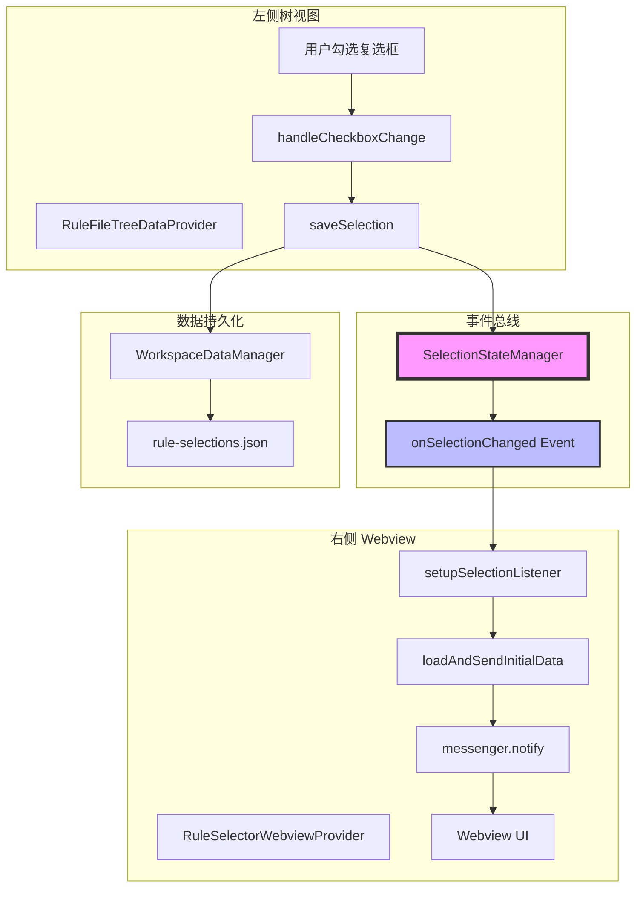
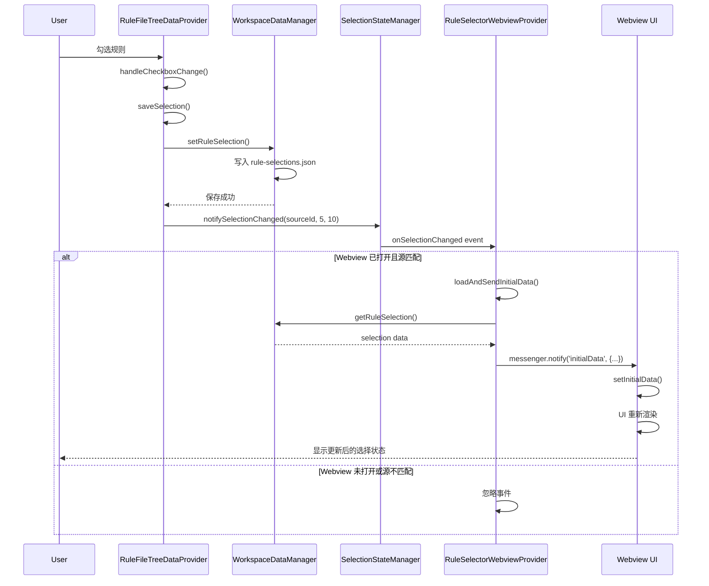
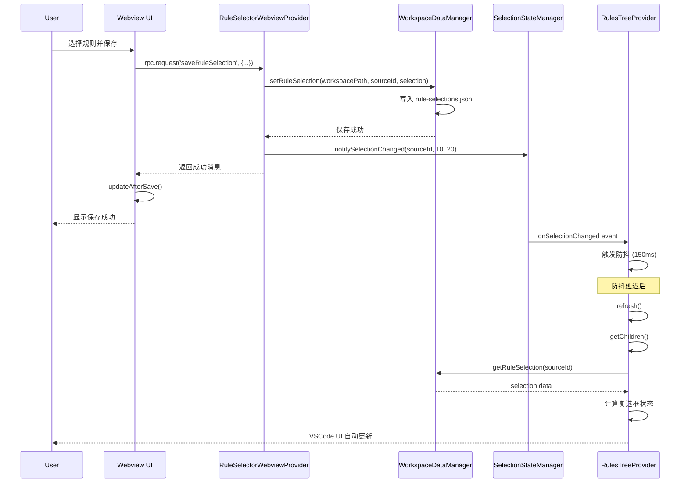
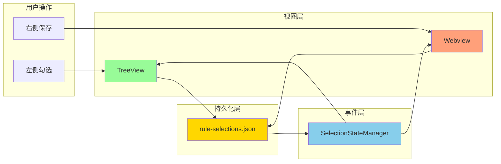

# 规则选择同步机制流程图

## 整体架构



## 左侧 → 右侧同步流程



## 右侧 → 左侧同步流程



## 事件过滤逻辑

```mermaid
flowchart TD
    Start([收到 onSelectionChanged 事件])
    Check1{Webview 是否打开?}
    Check2{Messenger 是否初始化?}
    Check3{事件源是否匹配当前源?}
    Process[重新加载并推送数据]
    Ignore[忽略事件]

    Start --> Check1
    Check1 -- 否 --> Ignore
    Check1 -- 是 --> Check2
    Check2 -- 否 --> Ignore
    Check2 -- 是 --> Check3
    Check3 -- 否 --> Ignore
    Check3 -- 是 --> Process

    Process --> LoadData[loadAndSendInitialData]
    LoadData --> Notify[messenger.notify('initialData')]

    style Start fill:#e1f5e1
    style Process fill:#ffe1e1
    style Ignore fill:#f0f0f0
    style Check3 fill:#fff4e1
```

## 数据流



## 关键数据结构

### SelectionStateChangeEvent

```typescript
interface SelectionStateChangeEvent {
  sourceId: string; // 规则源 ID
  selectedCount: number; // 已选择的规则数量
  totalCount: number; // 总规则数量
  timestamp: number; // 事件时间戳
}
```

### RuleSelection (持久化格式)

```typescript
interface RuleSelection {
  mode: 'include' | 'exclude'; // 选择模式
  paths?: string[]; // 包含的文件路径
  excludePaths?: string[]; // 排除的文件路径（未来扩展）
}
```

---

**说明**：

- 蓝色框：事件总线核心
- 绿色框：用户操作入口
- 橙色框：视图层
- 黄色框：数据持久化层
