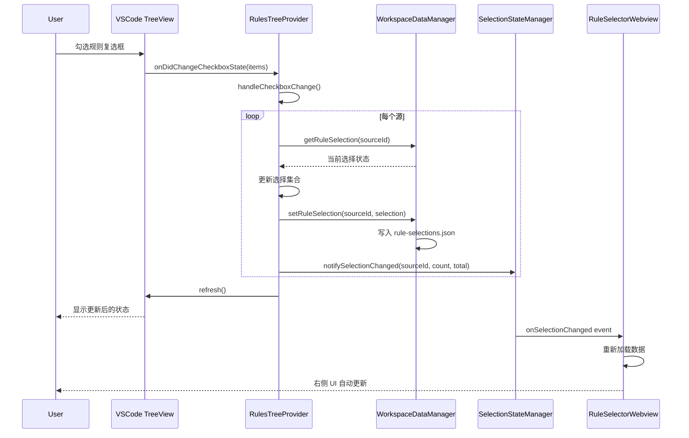
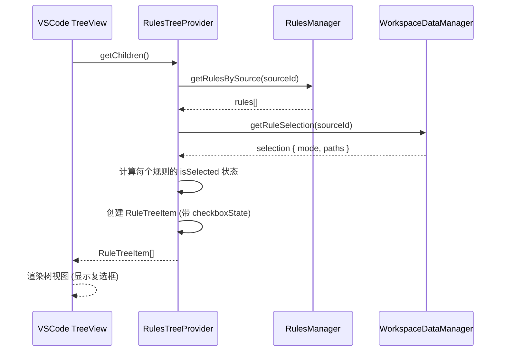

# 左侧规则树视图复选框功能实施文档

## 概述

为左侧主规则树视图（`RulesTreeProvider`）添加复选框功能，使用户可以直接在侧边栏勾选/取消规则，与右侧 Webview 选择器保持双向同步。

## 实时双向同步机制

### 同步流程

**左侧 → 右侧同步：**

```
左侧树视图勾选
    ↓
handleCheckboxChange() 立即执行
    ↓
保存到 .turbo-ai-rules/rule-selections.json
    ↓
触发 SelectionStateManager.notifySelectionChanged()
    ↓
右侧 Webview 监听器 (setupSelectionListener) 接收事件
    ↓
刷新 Webview 数据 (loadAndSendInitialData)
    ↓
右侧复选框状态更新
```

**右侧 → 左侧同步：**

```
右侧 Webview 勾选
    ↓
store.selectNode() 立即执行
    ↓
通过 RPC 发送 'updateRuleSelection' notify
    ↓
扩展端 updateRuleSelection 处理器接收
    ↓
保存到 .turbo-ai-rules/rule-selections.json
    ↓
触发 SelectionStateManager.notifySelectionChanged()
    ↓
左侧树视图监听器接收事件（150ms 防抖）
    ↓
refresh() 刷新树视图
    ↓
左侧复选框状态更新
```

### 关键实现

**右侧实时同步**（`src/webview/rule-selector/store.ts`）：

```typescript
selectNode: (path, checked, isDirectory) => {
  // ... 更新 selectedPaths 状态

  // 实时同步到扩展端
  import('../common/messaging').then(({ createWebviewRPC }) => {
    const rpc = createWebviewRPC();
    rpc.notify('updateRuleSelection', {
      sourceId: state.currentSourceId,
      paths: newSelectedPaths,
    });
  });
};
```

**扩展端处理器**（`src/providers/RuleSelectorWebviewProvider.ts`）：

```typescript
messenger.register('updateRuleSelection', async (payload) => {
  const { sourceId, paths } = payload;

  // 立即持久化
  await dataManager.setRuleSelection(workspacePath, sourceId, {
    mode: 'include',
    paths,
  });

  // 触发事件通知左侧刷新
  selectionStateManager.notifySelectionChanged(sourceId, paths.length, totalCount);
});
```

### "确认"按钮的作用

- **旧行为**：点击"保存"才持久化选择
- **新行为**：勾选时已实时持久化，"确认"按钮作为最终确认
- **UI 更新**：按钮文字改为"确认"，tooltip 说明"已实时同步到左侧树视图"

## 背景

### 原有实现

- **左侧树视图**（`RulesTreeProvider`）：仅显示规则列表，没有选择功能
- **右侧 Webview**（`RuleSelectorWebviewProvider`）：提供完整的规则选择界面
- **文件树视图**（`RuleFileTreeDataProvider`）：已有复选框功能（用于文件系统视图）

### 用户需求

用户希望在左侧主规则树视图中也能直接勾选规则，而不是每次都要打开右侧 Webview。

## 解决方案

### 技术方案

使用 VSCode TreeView API 的复选框功能：

1. **启用复选框**：设置 `manageCheckboxStateManually: true`
2. **显示复选框状态**：为每个规则节点设置 `checkboxState`
3. **监听状态变更**：注册 `onDidChangeCheckboxState` 处理器
4. **保存选择**：将选择状态保存到 `WorkspaceDataManager`
5. **触发事件**：通知 `SelectionStateManager` 同步更新

### 架构图

```
┌─────────────────────────────────────┐
│  左侧规则树视图 (RulesTreeProvider)  │
│  ┌───────────────────────────────┐  │
│  │ ☑ 规则 1                      │  │
│  │ ☐ 规则 2                      │  │
│  │ ☑ 规则 3                      │  │
│  └───────────────────────────────┘  │
└─────────────────┬───────────────────┘
                  │
                  │ checkbox change
                  │
                  ▼
┌─────────────────────────────────────┐
│  handleCheckboxChange()              │
│  1. 收集变更                         │
│  2. 更新 WorkspaceDataManager       │
│  3. 触发 SelectionStateManager      │
│  4. 刷新树视图                      │
└─────────────────┬───────────────────┘
                  │
        ┌─────────┴─────────┐
        │                   │
        ▼                   ▼
┌──────────────┐   ┌────────────────┐
│ 右侧 Webview │   │ 其他监听器     │
│ 自动更新     │   │ 自动更新       │
└──────────────┘   └────────────────┘
```

## 实现步骤

### 1. 为 RuleTreeItem 添加复选框状态

**文件**：`src/providers/RulesTreeProvider.ts`

**修改点**：在构造函数中为规则节点设置 `checkboxState`

```typescript
class RuleTreeItem extends vscode.TreeItem {
  constructor(
    public readonly data: TreeItemData,
    public readonly collapsibleState: vscode.TreeItemCollapsibleState,
  ) {
    super(data.label, collapsibleState);

    this.tooltip = this.getTooltip();
    this.iconPath = this.getIcon();
    this.contextValue = data.type;
    this.command = this.getCommand();
    this.description = this.getDescription();

    // 为规则节点添加复选框
    if (data.type === 'rule') {
      this.checkboxState = data.isSelected
        ? vscode.TreeItemCheckboxState.Checked
        : vscode.TreeItemCheckboxState.Unchecked;
    }
  }
  // ...
}
```

**关键点**：

- 只为 `type === 'rule'` 的节点添加复选框
- 根据 `data.isSelected` 设置初始状态
- 源节点和标签节点不显示复选框

### 2. 实现复选框状态变更处理

**文件**：`src/providers/RulesTreeProvider.ts`

**新增方法**：`handleCheckboxChange()`

```typescript
/**
 * @description 处理复选框状态变更
 * @return {Promise<void>}
 * @param items {readonly [RuleTreeItem, vscode.TreeItemCheckboxState][]}
 */
async handleCheckboxChange(
  items: readonly [RuleTreeItem, vscode.TreeItemCheckboxState][],
): Promise<void> {
  try {
    const workspaceFolders = vscode.workspace.workspaceFolders;
    if (!workspaceFolders || workspaceFolders.length === 0) {
      Logger.warn('No workspace folder found when handling checkbox change');
      return;
    }

    const workspacePath = workspaceFolders[0].uri.fsPath;
    const changesBySource = new Map<string, Set<string>>();

    // 收集每个源的选择变更
    for (const [item, checkState] of items) {
      if (item.data.type !== 'rule' || !item.data.rule?.filePath) continue;

      const sourceId = item.data.rule.sourceId;
      const filePath = item.data.rule.filePath;

      if (!changesBySource.has(sourceId)) {
        // 获取该源的当前选择状态
        const selection = await this.workspaceDataManager.getRuleSelection(sourceId);
        const currentPaths = new Set(selection?.paths || []);
        changesBySource.set(sourceId, currentPaths);
      }

      const paths = changesBySource.get(sourceId)!;
      if (checkState === vscode.TreeItemCheckboxState.Checked) {
        paths.add(filePath);
      } else {
        paths.delete(filePath);
      }
    }

    // 保存每个源的选择状态
    for (const [sourceId, paths] of changesBySource.entries()) {
      const selection = {
        mode: 'include' as const,
        paths: Array.from(paths),
      };

      await this.workspaceDataManager.setRuleSelection(workspacePath, sourceId, selection);

      // 触发选择变更事件
      const totalCount = this.rulesManager.getRulesBySource(sourceId).length;
      this.selectionStateManager.notifySelectionChanged(sourceId, paths.size, totalCount);

      Logger.info('Rule selection updated via checkbox', {
        sourceId,
        selectedCount: paths.size,
        totalCount,
      });
    }

    // 刷新树视图
    this.refresh();
  } catch (error) {
    Logger.error('Failed to handle checkbox change', error instanceof Error ? error : undefined);
    vscode.window.showErrorMessage(`更新规则选择失败: ${error}`);
  }
}
```

**处理逻辑**：

1. **按源分组**：不同规则源的选择状态独立管理
2. **增量更新**：读取当前选择状态，只更新变更的项
3. **批量保存**：一次保存一个源的所有变更
4. **触发事件**：调用 `SelectionStateManager.notifySelectionChanged()` 通知其他组件
5. **刷新视图**：更新树视图显示最新状态

### 3. 注册复选框监听器

**文件**：`src/extension.ts`

**修改点**：在创建 TreeView 时启用复选框并注册监听器

```typescript
// 2. 注册 UI 提供者
const treeProvider = new RulesTreeProvider(configManager, rulesManager);
const treeView = vscode.window.createTreeView('turboAiRulesExplorer', {
  treeDataProvider: treeProvider,
  showCollapseAll: true,
  manageCheckboxStateManually: true, // 启用手动管理复选框状态
});

// 注册复选框变更处理器
treeView.onDidChangeCheckboxState(async (e) => {
  await treeProvider.handleCheckboxChange(e.items);
});
```

**关键配置**：

- `manageCheckboxStateManually: true` - 告诉 VSCode 我们手动管理复选框状态
- `onDidChangeCheckboxState` - 监听复选框变更事件

## 数据流

### 用户勾选复选框流程



### 初始状态加载流程



## 关键技术点

### 1. 复选框状态计算

根据选择模式计算规则是否被选中：

```typescript
// include 模式：路径在 paths 列表中 = 选中
if (selection.mode === 'include') {
  selectedPaths = new Set(selection.paths || []);
}
// exclude 模式：路径不在 excludePaths 列表中 = 选中
else {
  const excludePaths = new Set(selection.excludePaths || []);
  selectedPaths = new Set(rules.map((r) => r.filePath).filter((p) => p && !excludePaths.has(p)));
}
```

### 2. 批量更新优化

使用 `Map<sourceId, Set<filePath>>` 收集同一源的所有变更，减少磁盘 I/O：

```typescript
const changesBySource = new Map<string, Set<string>>();

for (const [item, checkState] of items) {
  const sourceId = item.data.rule.sourceId;
  const filePath = item.data.rule.filePath;

  if (!changesBySource.has(sourceId)) {
    const selection = await this.workspaceDataManager.getRuleSelection(sourceId);
    changesBySource.set(sourceId, new Set(selection?.paths || []));
  }

  const paths = changesBySource.get(sourceId)!;
  if (checkState === vscode.TreeItemCheckboxState.Checked) {
    paths.add(filePath);
  } else {
    paths.delete(filePath);
  }
}
```

### 3. 错误处理

```typescript
try {
  // 处理复选框变更
} catch (error) {
  Logger.error('Failed to handle checkbox change', error instanceof Error ? error : undefined);
  vscode.window.showErrorMessage(`更新规则选择失败: ${error}`);
}
```

## 与右侧 Webview 的同步

### 左侧 → 右侧

1. 用户在左侧勾选复选框
2. `handleCheckboxChange()` 保存选择到磁盘
3. 触发 `SelectionStateManager.notifySelectionChanged()`
4. `RuleSelectorWebviewProvider` 监听事件
5. 重新加载数据并推送到 Webview
6. Webview UI 自动更新

### 右侧 → 左侧

1. 用户在右侧 Webview 保存选择
2. `RuleSelectorWebviewProvider` 保存选择到磁盘
3. 触发 `SelectionStateManager.notifySelectionChanged()`
4. `RulesTreeProvider` 监听事件（已存在）
5. 调用 `refresh()` 刷新树视图
6. `getChildren()` 重新计算复选框状态
7. TreeView UI 自动更新

## 用户体验优化

### 1. 视觉反馈

- **复选框状态**：☑ 选中、☐ 未选中
- **图标变化**：选中的规则使用 `pass-filled` 图标（带颜色）
- **实时更新**：勾选后立即保存并刷新

### 2. 性能优化

- **批量处理**：同一源的多个变更一次性保存
- **增量更新**：只更新变更的项，不重新加载全部数据
- **防抖刷新**：事件监听器使用 150ms 防抖

### 3. 错误处理

- **工作区检查**：确保工作区存在
- **文件路径验证**：跳过没有文件路径的规则
- **异常捕获**：显示友好的错误提示

## 测试场景

### 手动测试

1. **基础功能**：

   - ✅ 勾选规则后，复选框显示为选中状态
   - ✅ 取消勾选后，复选框显示为未选中状态
   - ✅ 刷新后状态保持不变

2. **同步测试**：

   - ✅ 左侧勾选 → 右侧 Webview 自动更新
   - ✅ 右侧保存 → 左侧复选框自动更新
   - ✅ 多个源的选择状态独立管理

3. **批量操作**：

   - ✅ 同时勾选多个规则
   - ✅ 同时取消多个规则
   - ✅ 不同源的规则混合操作

4. **边界情况**：
   - ✅ 没有工作区时的处理
   - ✅ 规则文件路径为空的处理
   - ✅ 保存失败时的错误提示

### 自动化测试（建议）

```typescript
describe('RulesTreeProvider - Checkbox', () => {
  it('should set checkbox state based on selection', async () => {
    // 测试复选框状态初始化
  });

  it('should update selection on checkbox change', async () => {
    // 测试复选框变更处理
  });

  it('should trigger selection change event', async () => {
    // 测试事件触发
  });

  it('should handle multiple sources independently', async () => {
    // 测试多源独立管理
  });
});
```

## 已知限制

1. **性能考虑**：

   - 大量规则时，勾选/取消可能有轻微延迟
   - 已通过批量处理优化

2. **源节点复选框**：

   - 当前不支持源节点的"全选/全不选"功能
   - 可作为未来改进方向

3. **不确定状态**：
   - 当前不支持源节点的"部分选中"状态（Indeterminate）
   - 可通过描述文本显示选择比例

## 未来改进

1. **源节点全选**：

   - 点击源节点复选框 → 选中/取消该源的所有规则
   - 显示部分选中状态（Indeterminate）

2. **批量操作命令**：

   - 右键菜单 → "全选此源"、"清除此源选择"
   - 支持 Ctrl+A 全选当前视图

3. **撤销/重做**：

   - 支持复选框操作的撤销
   - 缓存操作历史

4. **拖拽支持**：
   - 支持拖拽规则到不同的源
   - 拖拽时保持选择状态

## 参考

- VSCode API: [TreeView.manageCheckboxStateManually](https://code.visualstudio.com/api/references/vscode-api#TreeView.manageCheckboxStateManually)
- VSCode API: [TreeView.onDidChangeCheckboxState](https://code.visualstudio.com/api/references/vscode-api#TreeView.onDidChangeCheckboxState)
- VSCode API: [TreeItemCheckboxState](https://code.visualstudio.com/api/references/vscode-api#TreeItemCheckboxState)
- 选择同步机制：`docs/development/implementation/rule-selection-sync.md`

---

**实施日期**：2025-11-14  
**版本**：v1.0.0  
**作者**：GitHub Copilot + ygqygq2
