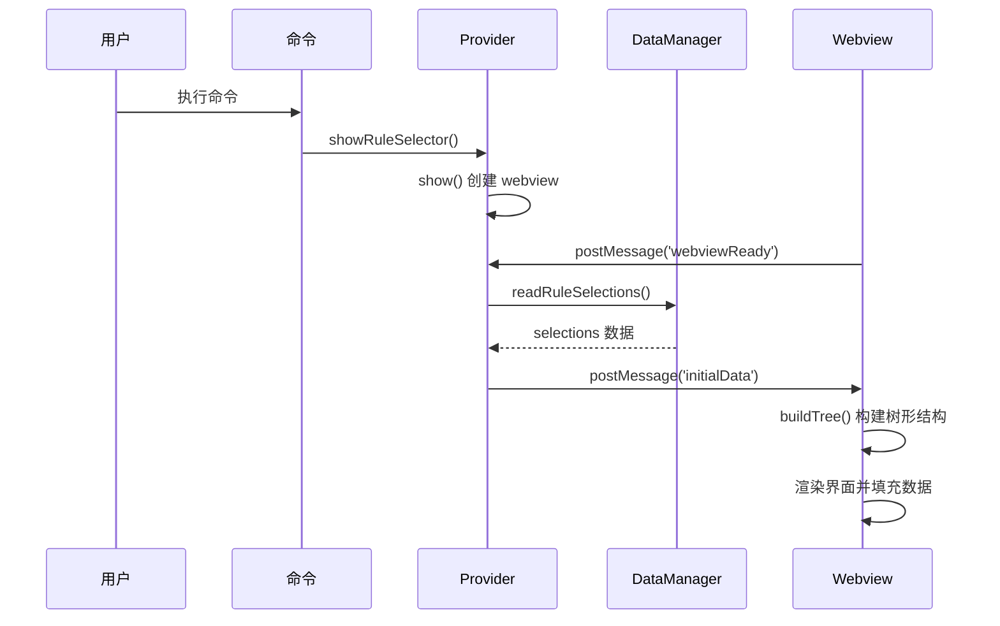
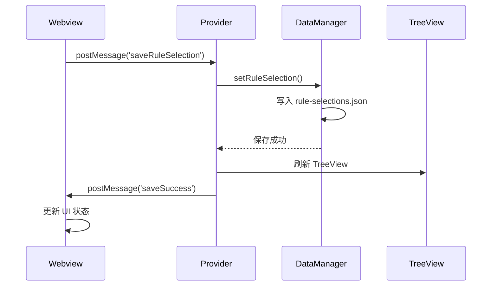
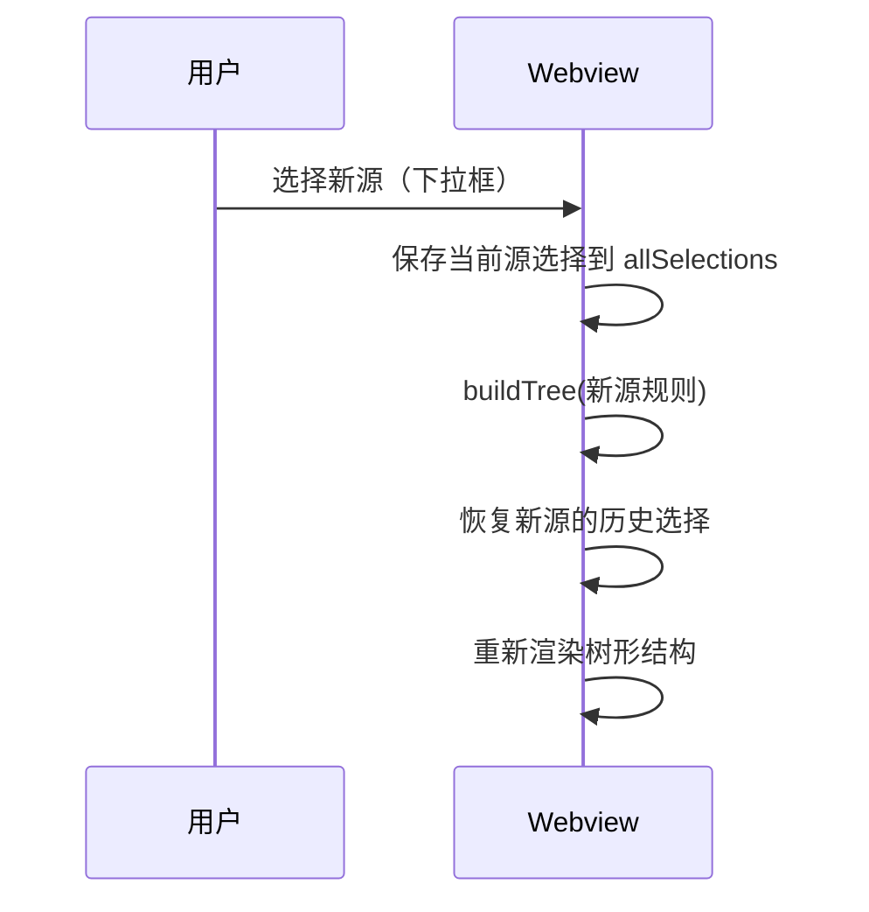

# 规则同步页实施文档

> **对应设计文档**：`.superdesign/design_docs/05-rule-sync-page.md`  
> **UI 原型**：`.superdesign/design_iterations/05-rule-sync-page_1.html`  
> **状态**：设计中（规则同步页 - 支持适配器映射）

---

## 功能概述

规则同步页允许用户：

1. **统一多源视图**：左侧面板以树形结构展示所有规则源（无需切换）
2. **规则选择**：通过复选框选择/取消选择文件或目录
3. **适配器映射**：右侧面板选择要同步到哪些适配器
4. **批量操作**：全选/清除/重置按钮
5. **同步执行**：选择规则 + 选择适配器 → 点击同步按钮 → 规则同步到目标适配器
6. **搜索过滤**：按标题、路径、标签搜索
7. **持久化**：保存选择配置到工作区缓存，下次打开自动恢复

---

## 架构实现

### 状态管理（Zustand）

**文件**：`src/webview/rule-selector/store.ts`

使用 Zustand 集中管理所有状态和业务逻辑，避免 useState 碎片化。

**核心优势**：

- ✅ 状态集中管理，清晰可见
- ✅ 业务逻辑封装在 actions 中，易于测试
- ✅ Redux DevTools 支持（开发环境）
- ✅ 性能优化：细粒度订阅
- ✅ 易于扩展（撤销/重做、搜索历史等）

**Store 状态管理**：

**状态分类**：

1. **基础状态**：

   - 工作区路径、当前源 ID、可用源列表
   - 规则列表、选择路径、总规则数
   - 搜索关键词、保存状态

2. **缓存状态**：

   - 所有源的规则数据（按源 ID 索引）
   - 所有源的选择状态
   - 树形节点结构

3. **核心 Actions**：
   - 初始化数据（setInitialData）
   - 切换源（switchSource）
   - 节点选择（selectNode）
   - 批量操作（全选/清空/重置）
   - 搜索过滤（setSearchTerm）

**实现文件**: `src/webview/rule-selector/store.ts`

### 后端（Provider）

**文件**：`src/providers/RuleSelectorWebviewProvider.ts`

**关键功能**：

1. **打开时加载数据** (`loadAndSendInitialData`)

   - 使用 `RuleQuery.getRulesBySourceMap()` 获取所有源的规则
   - 从 `WorkspaceDataManager` 读取已保存的规则选择
   - 等待前端 `webviewReady` 消息后发送 `initialData`

2. **保存规则选择** (`saveRuleSelection` 消息处理)

   - 接收前端发送的选择数据
   - 调用 `WorkspaceDataManager.setRuleSelection` 持久化
   - 刷新 TreeView
   - 返回成功/失败消息

3. **关闭窗口** (`close` 消息处理)
   - 调用 `panel.dispose()` 销毁 webview

### 前端（React + Zustand）

**核心文件**：

- `src/webview/rule-selector/App.tsx`：主组件，使用 Zustand store
- `src/webview/rule-selector/store.ts`：Zustand 状态管理
- `src/webview/rule-selector/TreeNode.tsx`：树形节点组件
- `src/webview/rule-selector/tree-utils.ts`：树形结构工具函数

**组件职责**：

**App.tsx - 主组件**：

- 使用 Zustand store 管理状态
- 监听扩展端消息（initialData, saveSuccess, saveError）
- 渲染 UI 组件（源选择器、搜索框、树形结构、操作按钮）
- 处理用户交互（点击保存、关闭等）

**TreeNode.tsx - 树节点组件**：

- 递归渲染树形结构
- 处理节点展开/折叠
- 处理复选框选择
- 显示规则元数据（标签、优先级）

**tree-utils.ts - 树形工具**：

- 将平面规则列表转换为树形结构
- 处理目录选择逻辑（全选/半选/不选）
- 搜索过滤逻辑
  updateAfterSave();
  break;
  }
  };

      window.addEventListener('message', handleMessage);
      return () => window.removeEventListener('message', handleMessage);

  }, [setInitialData, updateAfterSave]);

  // 渲染 UI
  return (
  <div>
  <select onChange={(e) => switchSource(e.target.value)}>...</select>
  {renderTreeNodes(treeNodes)}
  </div>
  );
  };

````

**为什么使用 Zustand**：

1. **避免 useState 碎片化**：之前有 13 个独立的 state，现在统一管理
2. **业务逻辑封装**：`switchSource` 等复杂逻辑从组件中抽离
3. **调试友好**：Redux DevTools 支持，可查看状态变更历史
4. **性能优化**：细粒度订阅，只有相关状态变化才重渲染
5. **易于测试**：可独立测试 store 逻辑
6. **未来扩展**：添加撤销/重做、搜索历史等功能更容易

**状态管理对比**：

| 特性       | useState（旧方案） | Zustand（新方案）  |
| ---------- | ------------------ | ------------------ |
| 状态数量   | 13 个独立 state    | 1 个集中 store     |
| 逻辑位置   | 分散在组件中       | 封装在 store 中    |
| 调试工具   | ❌ 无              | ✅ Redux DevTools  |
| 代码行数   | ~400 行            | ~300 行            |
| 性能       | 一般               | 优秀（细粒度订阅） |
| 测试难度   | 高（需要渲染组件） | 低（独立测试）     |
| 包体积增加 | 0 KB               | +5 KB (gzip)       |

**消息协议**：

| 消息类型            | 方向        | 数据结构                                       | 说明                     |
| ------------------- | ----------- | ---------------------------------------------- | ------------------------ |
| `webviewReady`      | 前端 → 后端 | -                                              | 前端加载完成，请求数据   |
| `initialData`       | 后端 → 前端 | `{ workspacePath, selections, rulesBySource }` | 打开时发送初始数据和规则 |
| `saveRuleSelection` | 前端 → 后端 | `{ sourceId, selection: { paths } }`           | 保存选择                 |
| `saveSuccess`       | 后端 → 前端 | `{ message }`                                  | 保存成功通知             |
| `error`             | 后端 → 前端 | `{ message, code }`                            | 错误通知                 |
| `close`             | 前端 → 后端 | -                                              | 关闭窗口                 |

**数据结构**：

```typescript
interface RuleItem {
  id: string;
  title: string;
  filePath: string;
  tags: string[];
  priority: number;
}

interface TreeNode {
  id: string; // 唯一标识
  name: string; // 显示名称
  path: string; // 完整路径
  type: 'directory' | 'file';
  children?: TreeNode[]; // 子节点（目录）
  expanded?: boolean; // 是否展开
  rules?: RuleItem[]; // 文件节点的规则列表
  ruleCount?: number; // 规则数量
}
````

---

## 树形结构实现

### 构建树形结构（tree-utils.ts）

**核心函数**：

1. **`buildTree(rules: RuleItem[]): TreeNode[]`**

   - 从平铺的规则列表构建树形结构
   - 按路径分割创建目录和文件节点
   - 自动排序：目录优先，然后按名称

2. **`toggleNode(nodes: TreeNode[], targetPath: string): TreeNode[]`**

   - 展开/收起指定路径的节点
   - 递归更新节点的 `expanded` 状态

3. **`getAllFilePaths(nodes: TreeNode[]): string[]`**

   - 获取所有文件路径（用于全选）
   - 递归遍历树结构

4. **`getDirectoryFilePaths(nodes: TreeNode[], targetPath: string): string[]`**
   - 获取指定目录下的所有文件路径
   - 用于目录级别的选择

### 树形节点组件（TreeNode.tsx）

**Props**：

- `node: TreeNodeType` - 节点数据
- `level: number` - 缩进层级（用于计算 paddingLeft）
- `isSelected: boolean` - 是否选中
- `isIndeterminate: boolean` - 是否半选状态（目录部分选中）
- `onToggle: (path: string) => void` - 展开/收起回调
- `onSelect: (path: string, checked: boolean, isDirectory: boolean) => void` - 选择回调

**交互逻辑**：

- 点击 chevron 图标：展开/收起目录
- 点击复选框：选择/取消选择节点
- 目录节点选择时：自动选择/取消所有子文件
- 半选状态：当目录下部分文件被选中时显示

---

## 数据存储

### 存储位置

规则选择数据存储在工作区缓存目录：

```
Linux: ~/.cache/.turbo-ai-rules/workspaces/{workspaceHash}/rule-selections.json
macOS: ~/Library/Caches/.turbo-ai-rules/workspaces/{workspaceHash}/rule-selections.json
Windows: %LOCALAPPDATA%\.turbo-ai-rules\workspaces\{workspaceHash}\rule-selections.json
```

> `{workspaceHash}` 是工作区路径的 SHA256 哈希值（前 16 位）

### 数据格式

```json
{
  "version": 1,
  "workspacePath": "/path/to/workspace",
  "lastUpdated": "2025-11-13T10:00:00.000Z",
  "selections": {
    "source-id-1": {
      "mode": "include",
      "paths": ["rule1.md", "folder/rule2.md"]
    },
    "source-id-2": {
      "mode": "exclude",
      "excludePaths": ["ignore.md"]
    }
  }
}
```

### API 方法

**WorkspaceDataManager**：

- `readRuleSelections()`: 读取所有规则选择
- `getRuleSelection(sourceId)`: 获取特定源的选择
- `setRuleSelection(workspacePath, sourceId, selection)`: 保存选择
- `deleteRuleSelection(workspacePath, sourceId)`: 删除选择

---

## 交互流程

### 打开规则选择器



### 保存规则选择



### 切换规则源



---

## 用户操作

### 多源管理

1. **切换源**：

   - 工具栏显示源选择下拉框（仅多源时显示）
   - 切换源时自动保存当前源的选择
   - 加载新源的规则和历史选择
   - 每个源的选择状态独立存储

### 树形导航

1. **展开/收起目录**：

   - 点击 chevron 图标（▶/▼）展开/收起目录
   - 双击目录名也可展开/收起
   - 展开状态不持久化（刷新后重置）

2. **选择规则**：

   - **文件节点**：点击复选框选择/取消单个文件
   - **目录节点**：选择目录时自动选择所有子文件
   - **半选状态**：目录下部分文件被选中时，目录显示半选（indeterminate）

3. **浏览规则信息**：

   - 文件节点显示规则数量（括号中）
   - Hover 时显示高亮背景

4. **批量操作**：

   - 全选：选择当前源的所有规则
   - 清除：清除所有选择
   - 重置：恢复到上次保存的状态

5. **搜索过滤**：

   - 输入关键词按标题、路径、标签过滤规则
   - 实时过滤，支持模糊匹配

6. **统计信息**：
   - 总规则数：当前源的所有规则数量
   - 已选：选中的规则数量
   - 排除：未选中的规则数量

### 保存与关闭

- **保存按钮**：

  - 只有当选择有变更时才启用
  - 点击后发送 `saveRuleSelection` 消息
  - 显示"保存中..."状态
  - 成功后更新 `originalPaths`

- **关闭按钮**：
  - 直接销毁 webview
  - 不保存未提交的更改（未来可添加确认提示）

---

## 测试要点

### 单元测试（Vitest）

**文件**：`src/test/unit/providers/RuleSelectorWebviewProvider.spec.ts`

**覆盖场景**：

- ✅ 单例模式验证
- ✅ 保存消息处理逻辑
- ✅ 初始数据加载逻辑
- ⏳ 错误处理（无工作区、保存失败等）

### 集成测试（Mocha）

**待实现**：

- 完整的打开 → 选择 → 保存 → 关闭流程
- 跨源选择（多个规则源）
- 文件系统错误场景

测试文件将位于：`src/test/suite/ruleSelectorWebview.test.ts`

---

## 已知问题与改进

### 已实现功能

1. ✅ **多源支持**：工具栏显示源选择下拉框，支持不同源之间的切换
2. ✅ **树形结构**：按文件夹层级显示规则，支持展开/折叠
3. ✅ **Zustand 状态管理**：集中管理状态，业务逻辑封装，易于调试和测试
4. ✅ **选择逻辑优化**：修复复选框闪烁、双击触发、状态丢失等问题

### 下一步改进

1. **搜索功能增强**：

   - 搜索时高亮匹配的树节点
   - 自动展开包含匹配项的文件夹
   - 支持正则表达式搜索

2. **高级过滤**：

   - 按标签筛选（多选）
   - 按优先级排序
   - 按文件路径模式匹配

3. **批量操作增强**：

   - 导入/导出选择配置（JSON）
   - 复制选择到其他工作区

4. **性能优化**：

   - 虚拟滚动（节点数量 > 500 时）
   - 延迟加载规则详情
   - 树节点缓存和增量更新

5. **用户体验**：
   - 拖拽选择多个节点
   - 键盘导航（方向键、空格选择）
   - 展开/收起状态持久化
   - 撤销/重做功能（Zustand 已为此做好准备）

---

## 技术选型说明

### 为什么选择 Zustand？

**背景**：初版使用 13 个 `useState` 管理状态，导致：

- 状态碎片化，难以维护
- 业务逻辑分散在组件中
- 调试困难（无法追踪状态变更）
- 测试困难（需要渲染整个组件）

**Zustand 带来的改进**：

| 方面     | 改进效果                                      |
| -------- | --------------------------------------------- |
| 代码质量 | 从 ~400 行降至 ~300 行，逻辑更清晰            |
| 可维护性 | 业务逻辑集中在 store，修改时不易遗漏          |
| 调试体验 | Redux DevTools 支持，可时间旅行调试           |
| 测试覆盖 | 可独立测试 store，不依赖组件渲染              |
| 性能     | 细粒度订阅，减少不必要的重渲染                |
| 扩展性   | 添加中间件（persist、devtools）轻松实现新功能 |
| 学习成本 | API 简洁，比 Redux 简单 10 倍                 |
| 包体积   | +5 KB (gzip)，对 VSCode Webview 可接受        |

**与其他方案对比**：

- **vs useState**：Zustand 胜出（状态多时 useState 难以管理）
- **vs Redux**：Zustand 更简洁（无需 actions、reducers、connect）
- **vs Context API**：Zustand 性能更好（避免 Provider 地狱）
- **vs Jotai/Recoil**：Zustand 更成熟稳定（生态更好）

**适用场景**：

- ✅ 状态数量 > 5 个
- ✅ 需要复杂业务逻辑封装
- ✅ 需要调试工具支持
- ✅ 团队对 Redux 模式熟悉
- ❌ 简单页面（欢迎页、关于页）仍可使用 useState

---

## 样式规范

遵循 VSCode Webview CSS 规范：

- **按钮**：`.button`、`.button-primary`、`.button-secondary`
- **输入框**：`.input`
- **图标**：使用 Codicons（`<Icon icon="list-tree" />`）
- **布局**：Flexbox，响应式设计
- **颜色**：使用 CSS 变量（`var(--vscode-*)`）
- **树形节点**：
  - `.tree-node-item`：节点容器，高度 32px
  - `.tree-node-chevron`：展开/收起图标，宽度 20px
  - `.tree-node-checkbox`：复选框
  - `.tree-node-icon`：文件/文件夹图标
  - `.tree-node-name`：节点名称，支持 ellipsis
  - 缩进：每层级 20px（`level * 20px`）

---

## 使用示例

### 典型工作流

1. **打开规则选择器**：

   ```
   命令面板 → "Turbo AI Rules: 选择同步规则"
   ```

2. **切换规则源**（多源场景）：

   - 工具栏下拉框选择目标源
   - 自动加载该源的规则树和历史选择

3. **浏览和选择规则**：

   - 点击 chevron 图标展开/收起文件夹
   - 点击复选框选择文件或文件夹
   - 选择文件夹时自动选择所有子文件
   - 使用搜索框过滤规则（如：搜索 "python" 查找相关规则）

4. **批量操作**：

   - 点击"全选"按钮选中所有规则
   - 点击"清除"按钮取消所有选择
   - 手动调整后，点击"重置"恢复到上次保存的状态

5. **保存选择**：

   - 修改选择后，"保存"按钮会变为可用状态
   - 点击"保存"按钮持久化选择到磁盘
   - 保存成功后，按钮状态重置

6. **下次使用**：
   - 再次打开规则选择器时，自动加载上次保存的选择
   - 树形结构重新构建，选择状态恢复

### 快速选择策略

**场景 1：排除特定文件夹**

1. 点击"全选"
2. 搜索要排除的规则（如 "deprecated"）
3. 取消勾选这些规则
4. 保存

**场景 2：只选择特定标签**

1. 点击"清除"
2. 搜索标签（如 "python"）
3. 选中所有匹配的规则
4. 保存

**场景 3：从零开始选择**

1. 打开选择器，默认所有规则未选中
2. 逐个或搜索后批量选择需要的规则
3. 保存

---

## 相关文件

- **Provider**：`src/providers/RuleSelectorWebviewProvider.ts`
- **前端**：`src/webview/rule-selector/App.tsx`
- **数据管理**：`src/services/WorkspaceDataManager.ts`
- **样式**：`src/webview/rule-selector/rule-selector.css`
- **单元测试**：`src/test/unit/providers/RuleSelectorWebviewProvider.spec.ts`

---

## 更新日志

- **2025-11-13**：初始实现
  - ✅ 基本的选择/保存功能
  - ✅ 打开时加载已保存数据
  - ✅ 实际规则列表显示（从 RulesManager 获取）
  - ✅ 复选框选择交互
  - ✅ 搜索过滤功能（按标题/路径/标签）
  - ✅ 统计信息显示（总数、已选、排除）
  - ✅ 全选/清除/重置批量操作
  - ⏳ 多源切换（待实现）
  - ⏳ 树形结构（待实现）
